# Rodeo Hot Sauce
This website has been created for a fictitious hot sauce brand, "RODEO HOT SAUCE". 

[Click here to view live website](https://rodeo-hot-sauce.herokuapp.com/)
## Table of Contents
[Website Owners Objectives](#objectives)

[User Experience - UX](#UX)

[Design](#design)

[Features](#features)

[Languages and Technologies](#tech)

[Testing](#testing)

[Deployment](#deployment)

[Credits](#credits)

## Brand Objectives
The primary objectives of the website are to enable to brand to:

* Increase brand awareness
* Increase sales
* Promote customer loyalty
* Generate a sense of community amongst consumers
* Collect customer data
* Improve understanding of consumers

## UX
### User Profiles
As a user of this website, I am someone looking to find recipes or to contribute recipes to a community. I am an English speaker with an interest in cooking with hot sauce.

### User Stories
As a user of the website, I want:
* To be able to navigate through the website in an intuitive and easy fashion
* To discover popular recipes involving hot sauce
* To discover new recipes involving hot sauce
* To be able to quickly and easily search the recipes to find specific ingredients or meal types
* To contribute my own recipes to the website community
* To be able to quickly edit or delete recipes that I have contributed
* To be able to save recipes that interest me and be able to access them quickly
* To be able to rate recipes and have those ratings influence the information hierarchy throughout the website
* To be able to log in and log out of the website easily
* For the data presented to me to be specific to me.

## Design

### Wireframes
[Click here to see index.html wireframes](static/images/readme-images/wireframes/index.png)

[Click here to see login.html wireframes](static/images/readme-images/wireframes/login.png)

[Click here to see register.html wireframes](static/images/readme-images/wireframes/register.png)

[Click here to see add-recipes.html wireframes](static/images/readme-images/wireframes/add-recipes.png)

[Click here to see my-recipes.html wireframes](static/images/readme-images/wireframes/my-recipes.png)

[Click here to see all-recipes.html wireframes](static/images/readme-images/wireframes/all-recipes.png)

[Click here to see recipe-page.html wireframes](static/images/readme-images/wireframes/recipe-page.png)

### Mock-ups
[Click here to see index.html mock-ups](static/images/readme-images/mock-ups/index-mock-up.jpg)

[Click here to see login.html mock-ups](static/images/readme-images/mock-ups/login-mock-up.jpg)

[Click here to see register.html mock-ups](static/images/readme-images/mock-ups/register-mock-up.jpg)

[Click here to see add-recipes.html mock-ups](static/images/readme-images/mock-ups/add-recipe-mock-up.jpg)

[Click here to see my-recipes.html mock-ups](static/images/readme-images/mock-ups/my-recipes-mock-up.jpg)

[Click here to see all-recipes.html mock-ups](static/images/readme-images/mock-ups/all-recipes-mock-up.jpg)

[Click here to see recipe-page.html mock-ups](static/images/readme-images/mock-ups/recipe-page-mock-up.jpg)

### Colour Scheme
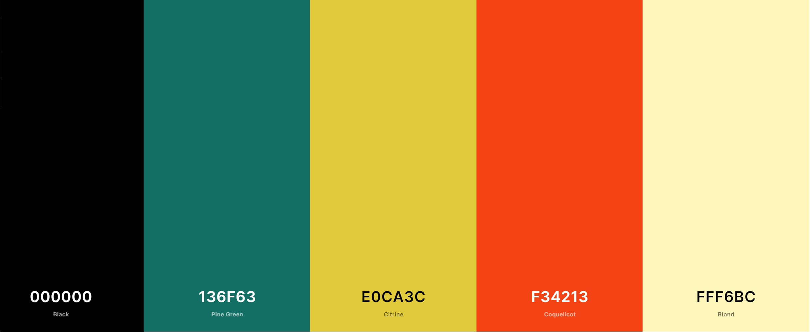
The colours found throughout the website were selected using the [Coolors](https://coolors.co/) colour scheme generator. I created new with the generator until I found one that featured a selection of bright and lively, but not garish colours.
The 'Pine Green' colour found in the header and footer provides a strong background on which brings clarity to the bold white logo and links. The colour is also used for all button elements found throughout the website which brings consistency and allows the user to quickly see that the elements are interactive.
The bright yellow 'Citrine' colour is used as a background to the main body of the website. This colour contrasts well with the 'Pine Green' header and footer and provides a bright, fresh and natural feel to the site.
The lighter 'Blond' colour works well against the 'Citrine' to highlight different aspects of the website to the user, such as the recipe cards and containers for the search and filter elements. The lightness of the shade allows for the black font, any clickable 'Pine Green' buttons and recipe images to stand out from the background.

### Fonts
The font used for the 'Rodeo' logo is 'Young Heart', sourced from [wfonts](https://www.wfonts.com/). The font was chosen because of its similarities to old western wanted posters which fits the branding of the hot sauce. As well as this, the font is decorative and more interesting than standard block lettering, whilst still being legible. This also meant the font could be used throughout the website for the main navigational links and headings.

The font 'Bevan' is used in all sub-headers and buttons throughout the website. This font was sourced from [Google Fonts](https://fonts.google.com/). Once again, this font was chosen because of its similarities to old western wanted posters. The font is clear and striking, making it very effective at breaking up the page with sub-headers.

For the rest of the site, 'Open Sans' was used due to its clean and clear style. The recipe instructions and ingredients and rendered with this font as it is clear and easy to read, even at small font sizes. This font was also sourced from [Google Fonts](https://fonts.google.com/).

### Database Design
#### Database Collections
The image below lists the collections found in the MongoDB database. Whilst the 'Recipe' and 'Users' collections were created specifically for the Rodeo app, FS Files and FS Chunks were created automatically with the uploading of images to the database.
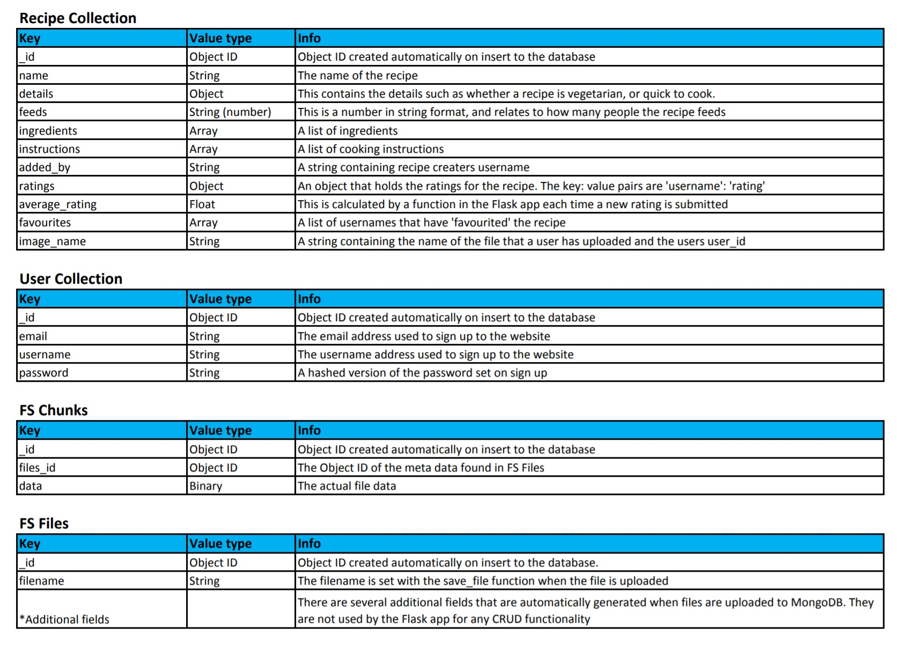

#### Database Schema
This image shows the database schema for the app. Where a line runs from '1' - '*', this highlights a one to many relationship.

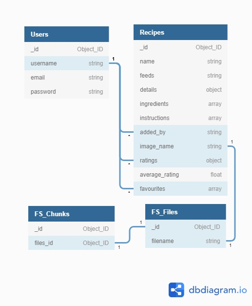

## Features
### Implemented Features

#### **Header and Footer**
The header and footer elements are consistent throughout the website. To the left of the header is a clickable logo, which links to **/index**. This is standard practice in web design and expected by the user.

To the right of the header on screen sizes of 768px wide or more, are three navigation links. On smaller screens, the links are contained in a dropdown menu which is triggered by a standard menu icon. Again, this is common in web design and the user will naturally understand the purpose of this icon. These links have clear 'hover' effects, that make the font slightly larger and brighter when the cursor is moved over them to reinforce to the user that these are clickable links.

The links themselves change depending on whether or not the user is logged in to the website. If the user is not logged in, a link to **'RECIPES'** is presented, where users can browse all the recipes available on the website, as well as **'LOGIN'** and **'REGISTER'**. A logged-in user will be presented with the same **'RECIPES'** link, as well as a link to **'MY RECIPES'**, where they have the options to view their favourite recipes, as well as view, add and edit recipes that they have uploaded. Finally, a **'LOG OUT'** link is provided.

At the right of the footer, the same 3 links are presented and are also dependent on the user being logged in or out. On screens smaller than 768px however, a link that reads **'BACK TO TOP'** is offered, which will return the user to the top of the current page.

At the left of the footer is a copyright notice, which uses JavaScript to automatically update the year displayed.

#### **/index**
The **/index** landing page immediately presents to the user a striking and colourful illustration of a bottle of 'Rodeo Hot Sauce' as well as the tagline 'ADD SOME KICK TO YOUR COOK'. This serves to suggest to the user that this website is exciting and interesting - as well as belonging to the 'Rodeo Hot Sauce' brand.

Just below this is a small 'WELCOME' section, highlighted with a bright red background. This section succinctly explains to the user the purpose of the website and what a user can expect to gain by registering and using the website.

At the bottom of the page is the 'SOME INSPIRATION section featuring 3 recipe cards presented in a column for screens of up to 768px wide and in a row for screens sized 992px wide and over. In between these sizes, 2 recipe cards are offered in a row to maintain the legibility and clarity of the cards, and to keep the page symmetrical.

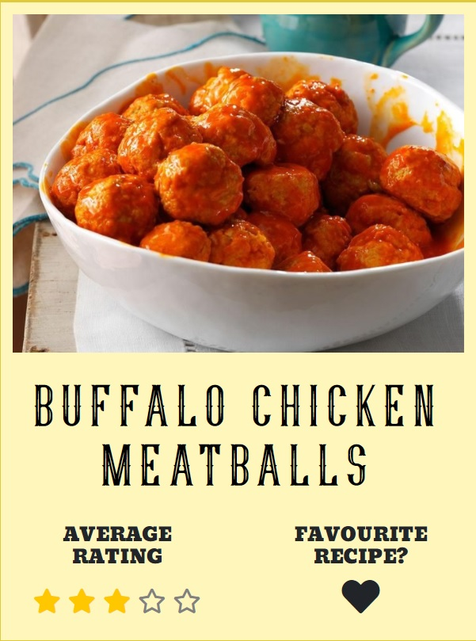

The recipe cards consist of an image, a recipe title, an average rating displayed by a star rating out of five, and a 'favourite recipe?' heart icon.

By clicking on the recipe cards image or recipe name, the user is taken to the page containing the actual recipe.

The font size for the recipe name is reduced with a JavaScript function if the title contains 28 or more characters, to keep all the content of the recipe cards within a similar size of each other across a row.

If a user attempts to click on the 'favourite recipe?' button without being logged in, a popover is presented which prompts the user to either **'LOG IN'** or **'REGISTER'** with those words acting as links to the relevant pages.

If the user is logged in, when hovering the cursor over the heart icons a tooltip is displayed which will suggest to the user either 'Add to favourites' or 'Remove from favourites' depending on whether or not the user has previously 'favourited' the recipe. If the recipe has been 'favourited', a solid heart icon is rendered, otherwise, a heart outline is rendered.

By clicking the 'Favourite Recipe' icon, the user can add or remove recipes from their **'MY RECIPES'** page. A message will slide down underneath the navigation bar and tell the user that the recipe has been successfully added or removed from their favourites.

If the user is not logged in, clicking on the heart icon will trigger a popover which prompts the user to register or login (an [example of this popover](#recipe-page) can be viewed in the **/recipe_page** section.)

These cards can be found on **/index**, **/all_recipes**, **/my_recipes** and **/added_recipies** and are always presented and function in the same way.

Below these recipe cards is a clickable button that says to the user 'CLICK HERE TO SEE MORE RECIPES'. This links to the **'RECIPES'** page which displays all recipes on the website. 

This button also has a cursor 'hover' effect to highlight that this is a clickable link.

Normal link           |  Cursor hover link
-------------------------:|:-------------------------
  |   

This button styling is found throughout the website for most clickable buttons to provide consistency and allow the user to quickly locate these interactive elements.

#### **/recipe_page**
The **/recipe_page** page holds a template that is used to render the actual recipes from the database. At the top left, if the user has navigated to the page from **/all_recipes**. **/my_recipes** or **/added_recipes** a 'back to...' link is rendered with the name of the page that the link directs to. If the user found the recipe page through any of the websites search features, the 'back to...' link will return the user to their search results to allow them to keep browsing them. 

If the user viewing the page is also the user who added the recipe, an 'edit' and a 'delete' button are added to the top of the page. The 'edit' button allows the user to edit their recipe on **/edit_recipe** and the 'delete' button triggers a modal that double-checks that they wish to delete the recipe. These buttons are also made available to the admin user 'rodeo', so that any malicious or inappropriate content can be quickly removed. 

At the top of the page is the recipe name, in big bold font that matches that of the logo. Beneath this, there is a subtle line of text which reads 'Recipe added by' and then the username of whoever added the recipe.

Next, there are several details about the recipe, such as how many people the recipe serves, whether the recipe is vegan, vegetarian or meat and several other details which are selected by the user from a list when they add the recipe. This can be seen in the [**'/add_recipe'** section](#add-recipe)

These details also make up the filters available in the search functionality of **/all_recipes**, **/my_recipes** and **/added_recipes**.

Below this, the recipe image is displayed. If the user who added the recipe included an image then that image will be displayed, however, if no image was added a default image of an illustrated 'Rodeo Hot Sauce' bottle with patterns around it is inserted here instead.

Under the image, the user can view the average rating for the recipe out of 5 stars, rounded to the nearest half star.

Next to the average rating stars are the user rating stars and the 'ADD RATING' button. If the user is logged in, they can submit their rating for the recipe by clicking on their chosen star rating and clicking the button directly below. If the user has already rated the recipe, their rating will be reflected in the number of coloured stars when the page loads. For instance, if the user has previously given the recipe a rating of 3/5, 3 of the stars will be coloured in when the recipe page is loaded.

When a user submits a rating, any existing rating for that recipe by that user will be replaced by the new rating. This means a user can only provide 1 rating for each recipe at a time.

If the user hits the 'ADD RATING' button before a star rating is selected, a tooltip is rendered to instruct the user to "Please click on a star to submit a rating!".

On screens smaller than 768px wide, these star rating features are replaced by a 'VIEW RATINGS' button which triggers a modal containing the average rating and user rating stars.

Whenever a new rating is added, a message slides down from the navigation bar to thank the user for their rating.

Next to the average and user rating stars is the 'FAVOURITE RECIPE' header and heart icon. 

If the user is logged in, this functions in the same way as the [heart icons on the recipe cards.](#heart-icons) 

If the user is not logged in, neither the 'favourite recipe' nor 'user rating' features will work. Instead, if the user tries to interact with either of them, a popover is triggered which informs the user to 'LOGIN or REGISTER to...' and then either '...save recipes to your favourites' or '...to rate recipes'.

Finally, the ingredients and instructions are presented. On larger screens, these are presented side by side, but below 992 pixels wide they are in a column. 

#### **/login**
The **'LOG IN'** page features a simple form that has a text input that will accept either a users email address or username, a text input for the user's password input and a submit button. If either of the text input fields are left blank, the form will not be validated and the user will be prompted to fill in the field.

If both fields are filled in, but the login details don't match details held in the database, a message slides down from the navigation bar to instruct the user "Login details incorrect, please try again." This instruction purposefully doesn't instruct the user which element of the form input is incorrect so as not to aid someone trying 'brute force' their way into the website with someone else's details.

On screens 768px wide or more, an illustration of a bottle of 'Rodeo Hot Sauce' is rendered to the right of the form to fill the space on the page.

Beneath the form, some text reads 'Need to sign up?' and then the line 'Click here to sign up' which acts as a link to the **'REGISTER'** page. This link is coloured with the blue shade that is typically found on links throughout the internet to make clear to a user that this is a link.

After successful submission of the form, the user is sent to **'MY RECIPES'** and a message slides down from the navigation bar to say 'Welcome,' and then the user's username.

#### **/register**
The **'REGISTER'** page features a form that contains 4 text input fields for the user's email address, preferred username, password and a 'retype password' input to ensure the user has entered their password choice correctly. If any of the text input fields are left blank, the form will not be validated and the user will be prompted to fill in the field.

Beneath the form, some text reads 'Already have an account?' and then the line 'Click here to log in' which acts as a link to the **'LOG IN'** page. This link is coloured with the blue shade that is typically found on links throughout the internet to make clear to a user that this is a link.

The username and password fields have minimum and maximum input lengths which are stated clearly beneath the inputs. Should the user input not conform to these requirements, the form will not be validated and the user will be made aware of the problem and the input on which the problem has occurred. These validations occur on the front-end with the browser, but the back end is also checking these requirements and will reject the form data if any of the inputs don't meet the requirements. 

The back-end also checks that the data sent with the password input matches that of the 'retype password' input. If not, a message slides down from the navigation bar to tell the user "Please make sure the password fields match." 

Another validation check carried out by the back-end is to check whether the email address or username provided with the form already exist in the database. If one of them does, the user is told either "Sorry, that email address already has an account" or "Sorry, that username is already taken" via a message that slides down from the navigation bar.

After successful submission of the form, the user is sent to **'MY RECIPES'** and a message slides down from the navigation bar to say 'Welcome to Rodeo,' and then the user's username.

On screens 768px wide or more, an illustration of a bottle of 'Rodeo Hot Sauce' is rendered to the right of the form to fill the space on the page.

#### **/my_recipes**
The **/my_recipes** page acts as a central hub for much of the app's functionality. This page presents to the user 3 buttons that can be used to navigate between **/my_recipes**, **/added_recipes** and **/add_recipe**. The buttons stay present on all three of the pages and act as a navigation bar within these pages. These buttons are styled in the same way as other buttons elements found throughout the website and include the same cursor hover effect to highlight that they are clickable links.

#### **/my_recipes, /all_recipes/ and /added_recipes**
These three pages have been grouped because they essentially contain the same features, although the recipes presented are different. The 'recipe cards' mentioned within this section are the same as the cards explained and pictures in the [**'/index** features section](#recipe-card).

The differences between the recipes on the  different pages are:

* **/all_recipes** displays all available recipes on the website. This page is accessible to any user.

* **/my_recipes** displays recipes that a user has previously 'favourited' with the heart icon on any of the recipe cards, or within an individual recipe page. This page is only accessible to users who are logged in and is the first page presented when the user logs in or clicks on the **'MY RECIPES'** link in the header or footer.

* **/added_recipes** displays all recipes that the user has uploaded to the website. As such, each recipe card presented on this page has an 'edit' button that links to **/edit_recipe** and a 'delete' button which triggers a modal asking if the user is sure they wish to delete the recipe. This page is also only accessible to logged-in users.

Each of the pages presents to the user 9 recipe cards at a time, with 9 x 1 card rows on screens of up 768px wide, 2 x 2 cards rows up to 992px wide and 3 x 3 card rows for any larger screens. This ensures the information on the recipe cards is clear and well laid out irrespective of the user's device.

The pages are all headed by a search and filter section. Within this section, users can use a text input field to search for keywords within either the recipe names or ingredients. Alongside this search input are options to filter the recipes by type ('Meat', 'Vegetarian' and 'Vegan') and to further filter by options such as 'Quick', 'Healthy' and 'Gluton Free'. The search and filter results will only return the relevant recipes from within the remit of that particular page (ie. a search on **/my_recipes** will only return recipes that the user has added to their favourites and that meet the terms of the search). If no results are returned from the search, the user is presented with text that states "NO RECIPES FOUND!
Please adjust your search term or filters and try again." a well as a button to reset the page and clear the search terms.

Just below the search and filter section, if there are recipes to be displayed, there are links to control whether to sort the recipes by average rating - with the highest rated recipes first, or with the newest recipes displayed first. The default is for the highest recipes to be displayed first.

If there are more than 9 recipes returned from a search, or that fall within that page's remit (such as the user adding more than 9 recipes and viewing **/added_recipes**), pagination links are made available to move through the recipes 9 cards at a time. If the user is on the first or last page of results, this is signified by the pagination link becoming greyed out and the cursor no longer becoming a 'pointer' when hovered over the link. 

#### /add_recipe
This page contains the form with which users can upload their own recipes and is only accessible to logged-in users. The form is validated by both the front and back-end and any requirements are clearly displayed to the user. The form is broken into sections in order to not overwhelm the user and allow the page to flow steadily.

The first section requires the user to add the recipe name, recipe type and any other details that apply to their recipe.

The 'meat', 'vegetarian' and 'vegan' options are radio button inputs, and one of them must be selected for the form to validate. Below them, there are several optional checkboxes that further categorise the recipe. These options are rendered at the top of the recipe page for that recipe, just below the recipe name which can be seen [in the **'/recipe_page'** section](#recipe-options-image)

These options are also the same as the options offered to users when using the filter aspect of the search functionality on **/all_recipes**, **/my_recipes** and **/added_recipes**.

Below this, the user is asked to input ingredients and instructions. Both of these sections feature a JavaScript-powered plus button, which adds an additional input to the relevant section, but only if all previous inputs have been used. Should the user try to add an input before using all available inputs, a tooltip pops up on the empty input to say 'Please use this input first'.

The instructions text inputs feature an auto-resize function (powered by JavaScript and written by James Padolsey http://james.padolsey.com) which makes the input grow as the user enters text. This makes it much easier for the user to look back at what they have written.  

Beneath the instructions inputs is the 'How many people does it feed' input! This is a required input that will accept any positive integer. This information is also presented with the other recipe details underneath the recipe name on the recipe page.

Finally, the user is presented with an optional file input to add an image to the recipe page. By clicking on the button, the file explorer for the user's device is opened and any image file can be selected. The file type is also validated at the back-end and will be rejected if the file extension isn't jpg, jpeg or png.

As well as the file type, the file size is also validated at both the front and back end in order to stop the database becoming reaching its data capacity too quickly. If a file larger than 1MB is selected, a JavaScript function triggers a browser alert that says 'File size too big, please choose a smaller file.' and the file is removed from the file input. If for any reason this validator fails, there is a limit set within the flask app that will reject any request data greater than 1.2MB. In this instance, the user should be redirected to the **/added_recipes** page.

If a file is selected that meets both the file type and size requirements, the file name is rendered next to the input to reassure the user that the file is selected.

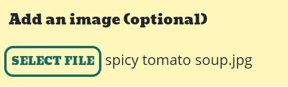

#### /edit_recipe
The **/edit_recipe** page contains mostly the same form as the **/add_recipe** page form, however, the inputs are pre-filled with the data from whichever recipe the user wishes to edit. 

The only other difference between the **/add_recipe** and **/edit_recipe** forms is the add image section. 

If the user has previously uploaded an image with the recipe, an option to keep that image is offered along with a preview of the image. Next to that are options to use the default image or to upload a new image. These options function as a radio input and therefore only one can be selected. If the default image option or the new image option is selected, the original image is deleted from the database and the new image presented in its place on the recipe page.

If however, there wasn't an image attached to the recipe, the add image section looks and behaves the same as it does on **/add_recipe**.

#### /404
The **404** page is displayed if the user tries to access a page that doesn't exist. For example, the user may try to access a recipe they have bookmarked in their browser, but the recipe has since been deleted. The **404** page simply states "It seems that whatever you're looking for isn't here" and then provides a link to **/all_recipes** with the text "Why not come look at some delicious recipes?". As with all other pages on the website, the header and footer are present to allow for easy access to the main pages of the website.
#### /500
Similar to the **404** page, the **500** page is displayed if the server runs into any issues, either due to a programming error or the server running into issues. This page states "It seems something has gone wrong!" and then provides a link to **/all_recipes** with the text "Why not come look at some delicious recipes?". Again, the header and footer are present to allow the user to easily navigate back through the website.

#### Potential Future Features
A very useful feature that is not currently available in the app is the ability for a user to reset their password should they forget it or need to change it. Unfortunately I believe this to be out of my skillset at this moment and do not have the time to do the research neccessary to implement this feature.

Another feature I would like to add is a dashboard available to the website admin, which could display statistics useful to the 'Rodeo Hot Sauce' brand. These statistics could highlight trends such as growing popularity of certain meal types which would be useful for marketing purposes.

To further encourage users to register and contribute to the website, I would like to add the ability to add comments to the recipe pages. I believe this would be an effective way to boost the sense of community within the users of the website.

## Languages and Technologies
### Languages
The front-end of the website is built with HTML, CSS and JavaScript and the back-end in Python.

### Technologies
#### IDE and Version control and Deployment
* [Gitpod](https://www.gitpod.io/)
   * The IDE used to write the code for the website.
   
* [Git](https://git-scm.com)
   * Used for version control during the website build via the command terminal in Gitpod
   
* [GitHub](https://pages.github.com/)
   * Used to store the code after being 'committed' and 'pushed' using Git. The website is now hosted via GitHub pages.

* [Heroku](https://www.heroku.com/)
   * Used to deploy the website

#### Database
* [MongoDB](https://www.mongodb.com/)
   * The database used to store the recipe and user data.

#### Libraries, Frameworks and Packages 
* [Bootsrap](https://getbootstrap.com/)
   * Used to provide structure, responsiveness and some CSS styling to the front-end. Also used to add modals, tooltips, dropdowns and popovers.

* [Jquery](https://jquery.com/)
   * jQuery is required to power certain Bootstrap features, including elements mentioned above. jQuery is also used to shorten the syntax required to achieve certain functions, such as targeting HTML elements within the JavaScript file.

* [Flask](https://flask.palletsprojects.com/)
   * A micro-web framework. Flask is packaged with Werkzeug and Jinja which work together to simplify accessing data at the back-end and presenting it to the client at the front-end. 

* [Pymongo](https://pymongo.readthedocs.io/)
   * A MongoDB driver. Used to enable the Python code to interact with MongoDB.

* [WTForms](https://wtforms.readthedocs.io/)
   * Used to create the form elements of the website with Python and add form validation to the back end. WTForms also provides protection from CSRF attacks.

#### Design and Fonts
* [Balsamiq](https://balsamiq.com/)
   * Software used to create wireframes of website.

* [Figmna](https://www.figma.com/)
   * Software used to create mock-ups of website.

* [Coolors](https://coolors.co/)
   * Used to generate the colour palette for the website.

* [Google Fonts](https://coolors.co/)
   * Used to provide the 'Open Sans' and 'Bevan' fonts used throughout the website.

* [Font Squirrel](https://www.fontsquirrel.com/)
   * Used to provide the 'Open Sans' and 'Bevan' fonts used throughout the website.

* [RealFaviconGenerator](https://realfavicongenerator.net/)
   * Used to refine the favicon and provide the HTML to link to the file.

* [dbdiagram](https://dbdiagram.io/)
   * Used to make image of database schema.

#### Testing and Optimisation
* [W3C Markup Validation Service](https://validator.w3.org/)
   * Validation of the HTML code.

* [W3C CSS Validation Service (Jigsaw)](https://jigsaw.w3.org/css-validator/)
   * Validation of the CSS code

* [JSHint](https://jshint.com/)
   * Validation of the JavaScript code.

* [Autoprefixer](https://autoprefixer.github.io/)
   * Used to ensure cross browser validity for CSS.

* [TinyPNG](https://tinypng.com/)
   * Used to compress any local images.

* [Am I Responsive?](http://ami.responsivedesign.is/)
   * Used to test for responsive design and to create the mock-ups found at the top of this README.

* [Chrome DevTools](https://developer.chrome.com/docs/devtools/)
   * Used to test responsivity of website and test contrast between backgrounds and fonts. Also used to check for any JavaScript errors or warnings printing the console.
   

## Testing

## Deployment
### Prerequisites

#### Github Repository
Prior to deploying the app to Heroku, the code was stored in a GitHub repository. This made it easy to push any changes from a local git repository to the remote GitHub repository and have Heroku automatically deploy the most recent version of the app from GitHub (see step 7 of 'Deployment to Heroku' below).

#### Application Requirements
In order for Heroku to know how to run the app, a requirements.txt file must be present in the repository's root folder. This file can be created by running the command `pip freeze > requirements.txt` from the command line. This will create a file that lists all the dependencies needed to run the app.

#### Heroku Procfile
Heroku also needs a 'Procfile' to know how to run the app. In this instance, the command `echo web: python app.py > Procfile` will create a file that gives Heroku the instructions that this is a web application and it can be run with the command `python app.py`.

#### MongoDB URI
To connect the app to the MongoDB database, the URI for the database can be found using the following steps:

1. Log in to MongoDB

2. Once on the MongoDB Dashboard, click on the 'Connect' button.

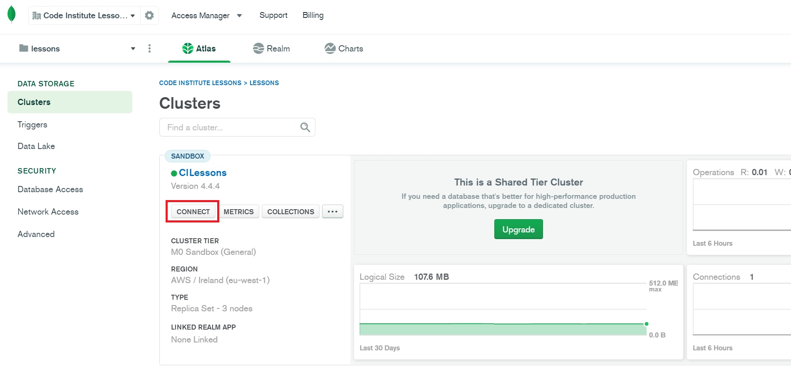
3. From the pop-up, select 'Connect your application'.

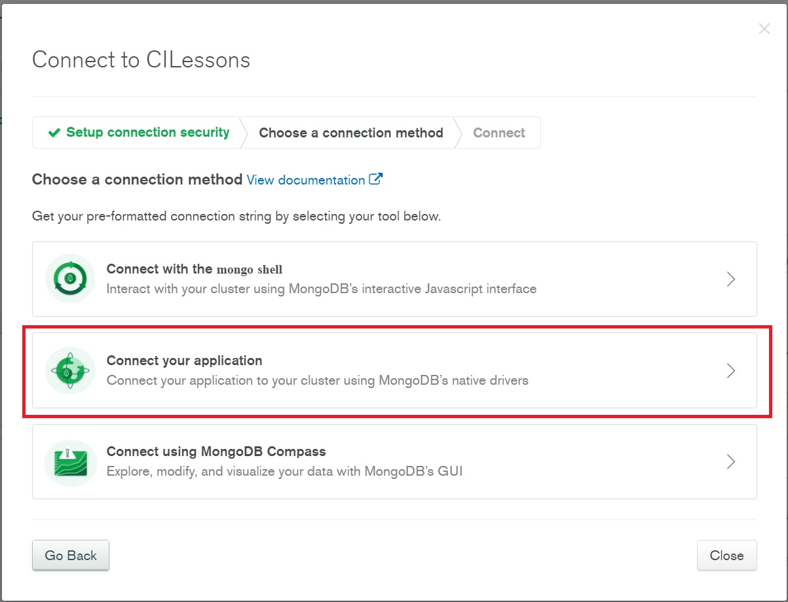

4. On the following menu, select the appropriate driver and driver version options, and the URI will be presented to you. As per the instructions below the URI, `"Replace <password> with the password for the richardThorp user. Replace myFirstDatabase with the name of the database that connections will use by default."`

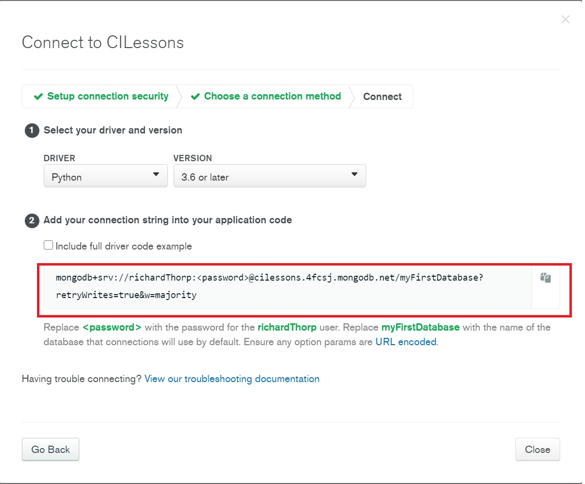

5. This URI should be kept in an 'env.py' file in the local repository with any other sensitive data, as it contains the password to the MongoDB database. The 'env.py' file must also be included in the 'gitignore' file to ensure that the data is never sent to the GitHub repository.

## Deployment to Heroku
With the code required to run the app all stored in a repository with Github, deploying the app with Heroku can be done following these steps:

1. Sign in/sign up to [Heroku](https://www.heroku.com/).

2. Once signed in, click on the 'Create New App' button.

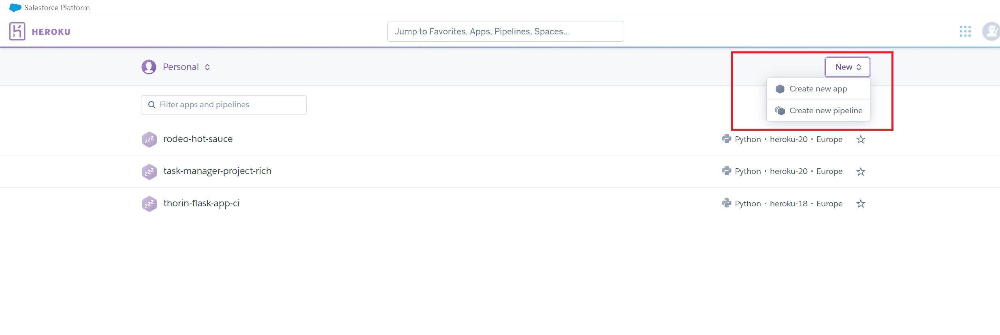

3. Name the app, select the local region and click 'Create App'.

4. In the top menu, select the 'Deploy' tab, and then click 'Connect to GitHub' in the 'Deployment method' section.

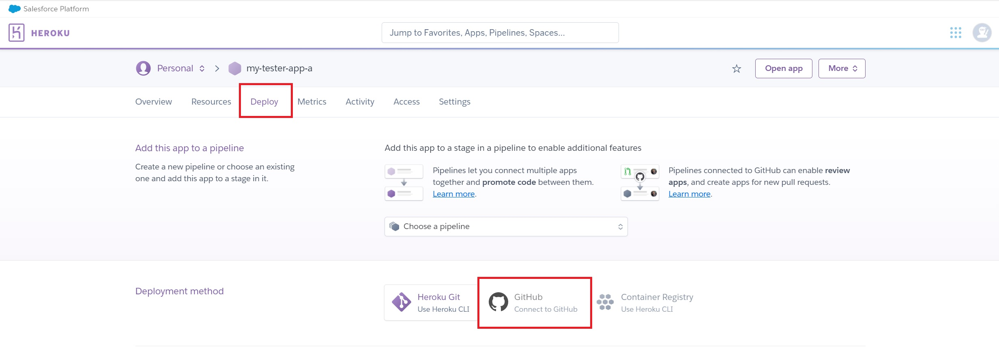

5. Connect your GitHub account to your Heroku account by clicking on the 'Connect to GitHub' button (if already connected, move to step 6).

6. Search for the GitHub repository which contains the app you wish to deploy, and then click 'connect'.

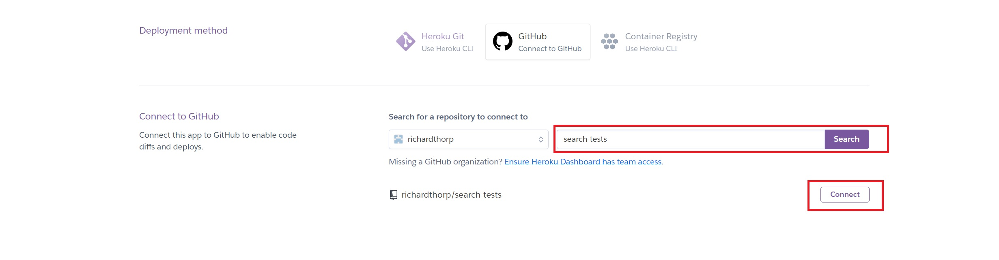

7. Once connected, you can choose to automatically deploy any updates made in the GitHub repository or to do so manually by selecting the branch you wish to deploy and clicking on the appropriate button.

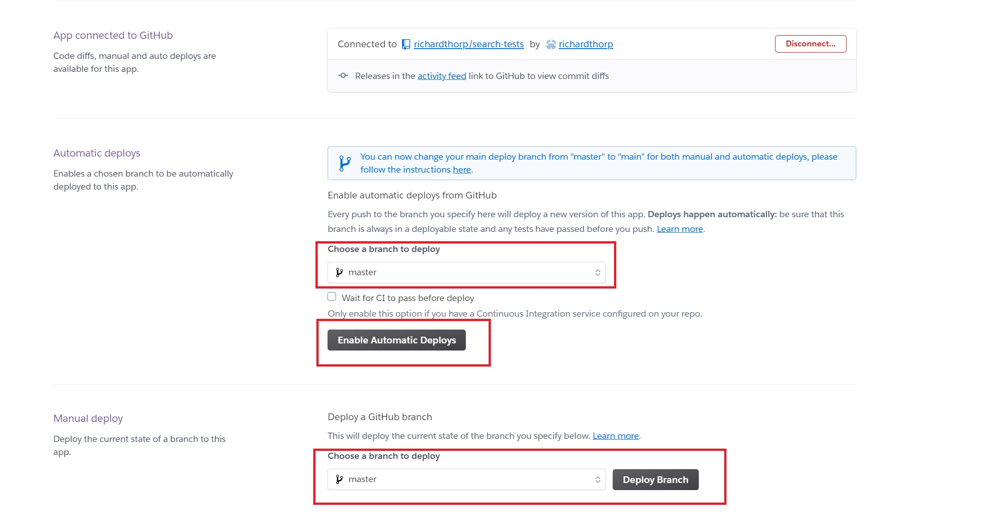

8. Following this, click on the 'Settings' tab and then click 'Reveal Config Vars'

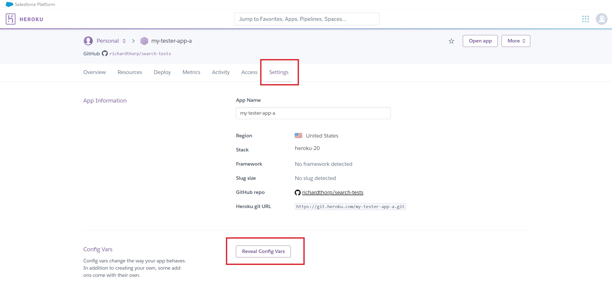

9. Within the 'Reveal Config Vars' section, add the variables which would be found in your local 'env.py' file. These variables are saved here as they contain sensitive data such as the password to the MongoDB database and the secret key required to use some of Flask's functionality.

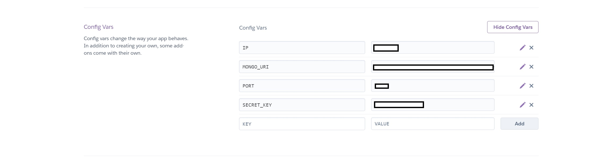

10. With all of the previous steps complete, as well as the prerequisites, the app will now run by clicking the 'Open app' button.

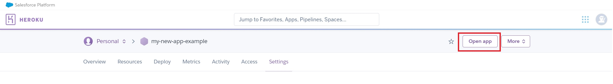

## Credits

### Code

### Content

### Acknowledgements
