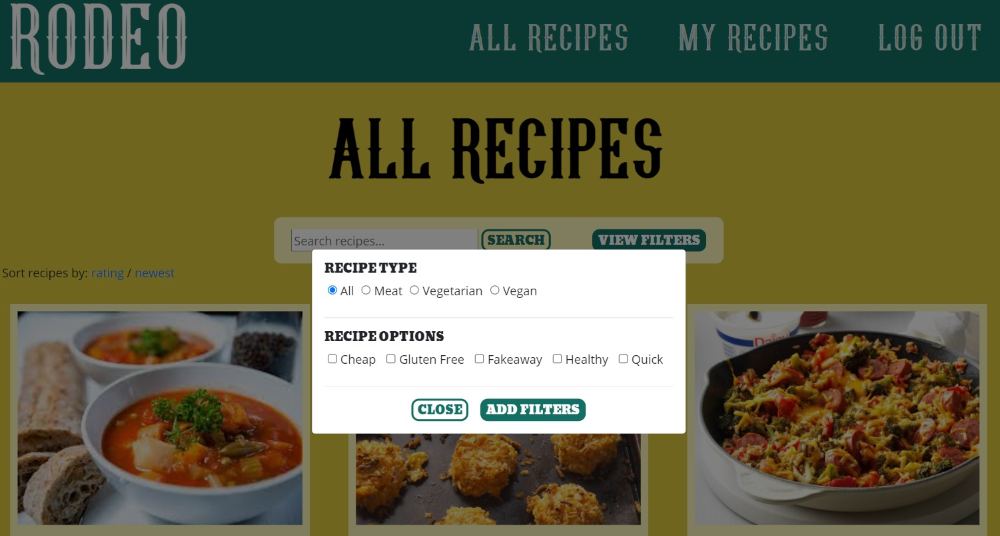
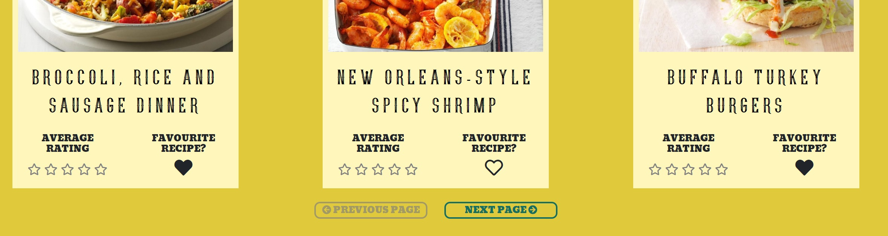
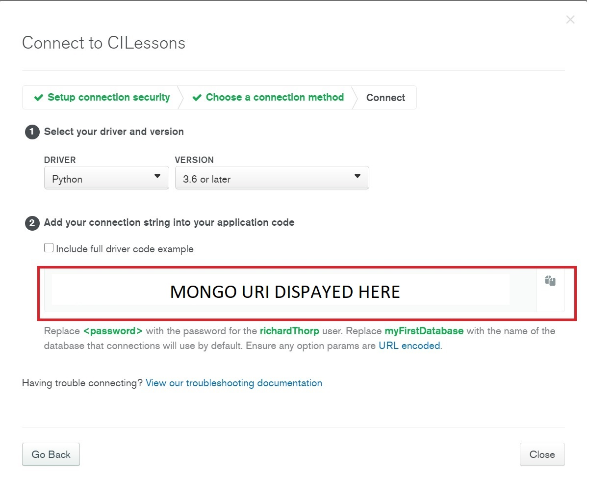

# Rodeo Hot Sauce
This website has been created for a fictitious hot sauce brand, "RODEO HOT SAUCE". The website allows registered users the ability to browse, add, rate and save recipes.

[Click here to view live website](https://rodeo-hot-sauce.herokuapp.com/)
## Table of Contents
[Brand Objectives](#objectives)

[User Experience - UX](#UX)

[Design](#design)

[Features](#features)

[Languages and Technologies](#tech)

[Testing](testing.md) (links to separate page)

[Deployment](#deployment)

[Credits](#credits)

## Brand Objectives
The primary objectives of the website are to enable to brand to:

* Increase brand awareness
* Increase sales
* Promote customer loyalty
* Generate a sense of community amongst consumers
* Collect customer data
* Improve understanding of consumers

## UX
### User Profiles
As a user of this website, I am someone looking to find recipes or to contribute recipes to a community. I am an English speaker with an interest in cooking with hot sauce.

### User Stories
#### As a first time user, I want:
* To quickly understand the purpose of the website
* To be able to register and sign in easily
* To be able to navigate through the website intuitively and easily
* To discover popular recipes involving hot sauce

#### As a returning user, I want:
* To be able to log in easily
* To be able to find new recipes easily

#### Shared user requirements:
As a user of the website, I want:
* To be able to quickly and easily search the recipes to find specific ingredients or meal types
* To contribute my own recipes to the website community
* To be able to quickly edit or delete recipes that I have contributed
* To be able to save recipes that interest me and be able to access them quickly
* To be able to rate recipes and have those ratings influence the information hierarchy throughout the website
* For the data presented to me to be specific to me.
* To be able to log out easily

## Design

### Wireframes
[Click here to see index.html wireframes](static/images/readme-images/wireframes/index.png)

[Click here to see login.html wireframes](static/images/readme-images/wireframes/login.png)

[Click here to see register.html wireframes](static/images/readme-images/wireframes/register.png)

[Click here to see add-recipe.html wireframes](static/images/readme-images/wireframes/add-recipe.png)

[Click here to see my-recipes.html wireframes](static/images/readme-images/wireframes/my-recipes.png)

[Click here to see all-recipes.html wireframes](static/images/readme-images/wireframes/all-recipes.png)

[Click here to see recipe-page.html wireframes](static/images/readme-images/wireframes/recipe-page.png)

### Mock-ups
[Click here to see index.html mock-ups](static/images/readme-images/mock-ups/index-mock-up.jpg)

[Click here to see login.html mock-ups](static/images/readme-images/mock-ups/login-mock-up.jpg)

[Click here to see register.html mock-ups](static/images/readme-images/mock-ups/register-mock-up.jpg)

[Click here to see add-recipes.html mock-ups](static/images/readme-images/mock-ups/add-recipe-mock-up.jpg)

[Click here to see my-recipes.html mock-ups](static/images/readme-images/mock-ups/my-recipes-mock-up.jpg)

[Click here to see all-recipes.html mock-ups](static/images/readme-images/mock-ups/all-recipes-mock-up.jpg)

[Click here to see recipe-page.html mock-ups](static/images/readme-images/mock-ups/recipe-page-mock-up.jpg)

### Colour Scheme

The colours found throughout the website were selected using the [Coolors](https://coolors.co/) colour scheme generator. I created new palettes with the generator until I found one that featured a selection of bright and lively, but not garish colours.
The 'Pine Green' colour found in the header and footer provides a strong background colour which brings clarity to the bold white logo and links. The colour is also used for nearly all button elements found throughout the website which brings consistency and allows the user to quickly see that the elements are interactive.
The bright yellow 'Citrine' colour is used as a background to the main body of the website. This colour contrasts well with the 'Pine Green' header and footer and provides a bright, fresh and natural feel to the site.
The lighter 'Blond' colour works well against the 'Citrine' to highlight different aspects of the website to the user, such as the recipe cards and containers for the search and filter elements. The lightness of the shade allows for the black font, any clickable 'Pine Green' buttons and recipe images to stand out from the background.

### Fonts
The font used for the 'Rodeo' logo is 'Young Heart', sourced from [wfonts](https://www.wfonts.com/). The font was chosen because of its similarities to old western wanted posters which fits the branding of the hot sauce. As well as this, the font is decorative and more interesting than standard block lettering, whilst still being legible. This also meant the font could be used throughout the website for the main navigational links and headings.

The font 'Bevan' is used in all sub-headers and buttons throughout the website. This font was sourced from [Google Fonts](https://fonts.google.com/). Once again, this font was chosen because of its similarities to old western wanted posters. The font is clear and striking, making it very effective at breaking up the page with sub-headers.

For the rest of the site, 'Open Sans' was used due to its clean and clear style. The recipe instructions and ingredients and rendered with this font as it is clear and easy to read, even at small font sizes. This font was also sourced from [Google Fonts](https://fonts.google.com/).

### Database Design
#### Database Collections
The image below lists the collections found in the MongoDB database. Whilst the 'Recipe' and 'Users' collections were created specifically for the Rodeo app, FS Files and FS Chunks were created automatically with the uploading of images to the database.

#### Database Schema
This image shows the database schema for the app. Where a line runs from '1' - '*', this highlights a one to many relationship.

## Features

### Shared Features
#### **Header and Footer**
* The header and footer elements are consistent and always available throughout the website.
* The 'RODEO' logo acts as a link to **/index**
* There are 3 links found at the right of the header
    * These links change depending on whether the user is logged in or not.
        * A logged out user is presented with **'ALL RECIPES'**, **'LOGIN'** and **'REGISTER'** 
        * A logged in user is presented with **'ALL RECIPES'**, **'MY RECIPES'** and  **'LOG OUT'**
        * On screens smaller than 678px wide, the links are hidden behind a menu icon which, on click, triggers a dropdown menu containing the links.
* On screens larger than 768px wide, the same 3 links are available in the footer. On smaller screens, a link 'BACK TO TOP' is presented which returns the user to the top of the current page.
* At the left of the footer is a copyright notice, which uses JavaScript to automatically update the year displayed.

#### **Recipe Cards**

* The recipe cards consist of an image, a recipe title, an average rating displayed by a star rating out of five, and a 'Favourite Recipe?' heart icon.
* By clicking on the recipe card's image or recipe name, the user is taken to the page containing the actual recipe.
* The font size for the recipe name is reduced with a JavaScript function if the title contains 28 or more characters, to keep all the content of the recipe cards within a similar size of each other across a row.
* The 'Average Rating' for each recipe is displayed using up to 5 stars and is rounded to the nearest 1/2 star.

* If the user is logged in, when hovering the cursor over the heart icons a tooltip is displayed which will suggest to the user either 'Add to favourites' or 'Remove from favourites' depending on whether or not the user has previously 'favourited' the recipe. 
* If the recipe has been 'favourited', a solid heart icon is rendered, otherwise, a heart outline is rendered.

* By clicking the 'Favourite Recipe' icon, the user can add or remove recipes from their **'MY RECIPES'** page. A message will slide down underneath the navigation bar and tell the user that the recipe has been successfully added or removed from their favourites.

* If a user attempts to click on the 'Favourite Recipe?' button without being logged in, a popover is presented which prompts the user to either **'LOG IN'** or **'REGISTER'** with those words acting as links to the relevant pages.

#### **Search and Filter Container**

* A text input that will match any words entered with text in the recipe names or ingredients found in the database
* A 'View Filters' button which launches the filter modal.
    * The modal enables the user to filter the recipes depending on recipe type (vegetarian, vegan and meat), as well as further filtering the recipes with options such as 'Healthy' and 'Gluten Free'.
    * The filters can be used in conjunction with the search text input.
    
* If no results are returned from the search, the user is presented with text that states "NO RECIPES FOUND! Please adjust your search term or filters and try again." a well as a button to reset the page and clear the search terms.

#### **Pagination Links**

* Can be found on any page which lists recipe cards where more than 12 recipes are available.
* On the first page of available recipes, the 'Previous Page' link is greyed out and not clickable.
* On the last page of available recipes, the 'Next Page' link is greyed out and not clickable.
* If there are less than 12 available recipes, the pagination links will not be displayed.

#### **Sort by: rating / newest links**
* Available on all pages that list the recipes
* By default, recipes are presented with the highest rated recipes first. 
* The user can toggle between sorting by newest or highest rated using the links.
* The sort by feature can be used in conjunction with the search and filter functionality

### Individual page features 
#### **/index**
This is the landing page for the website.

* A responsive hero image that fills the width of the page up to 2000px wide
* A short paragraph explaining the purpose of the website.
* The 'SOME INSPIRATION' section features up to 4 recipe cards depending on the size of the user's screen. This section displays the highest rated recipes available on the website.
* A link to the **'ALL RECIPES'** page which displays all recipes on the website. This button has a mouseover effect to highlight that this is a clickable link.

Normal link           |  Cursor hover link
-------------------------:|:-------------------------
  |   

#### **/recipe_page**
The **/recipe_page** page holds a template that is used to render the actual recipes from the database. 

* A 'BACK TO...' link. This link changes depending on where the user navigated to the recipe page from. 
    * If the user found the recipe page using any search and filter functionality, or after paginating through recipe cards, this link will return the user to the search results and/or the correct page of paginated results.
    * If the user navigated to the page from outside the website, no 'BACK TO...' link is presented.
* If the user viewing the page is also the user who added the recipe, an 'edit' and a 'delete' button are added to the top of the page.
    * The 'delete' button triggers a modal that asks the user to confirm that they wish to delete the recipe.
* A list of recipe details, including the recipe type and how many people the recipe feeds.
* A recipe image
    * If the user uploaded an image when they submitted the recipe, this will be displayed.
    * If no image was submitted with the recipe, a default image is presented here instead.

* An average rating score
    * The average rating is rounded to the nearest half star.
    * To prevent a single user rating resulting in the recipe being at the top or bottom of the average rating rankings, all recipes begin with 5 x 3 star ratings upon submission.
* A user rating input
    * If the user is logged in, they can submit their rating for the recipe by clicking on their chosen star rating and clicking the 'ADD RATING' button directly below. 
    * If the user has already rated the recipe, their rating will be reflected in the number of coloured stars rendered when the page loads.
    * When a user submits a rating, any existing rating for that recipe by that user will be replaced by the new rating. This means a user can only provide 1 rating for each recipe at a time.
    * If the user hits the 'ADD RATING' button before a star rating is selected, a tooltip is rendered to instruct the user to "Please click on a star to submit a rating!".
    * On screens smaller than 768px wide, these star rating features are replaced by a 'VIEW RATINGS' button which triggers a modal containing the average rating and user rating stars.
    * If the user is not logged in, clicking on the 'ADD RATING' button results in a popover that reads 'LOGIN or REGISTER to rate recipes' with links to **/login** and **/register**.
    * Whenever a new rating is added, a message slides down from the navigation bar to thank the user for their rating.
* A 'Favourite Recipe' heart icon toggle
    * This works in the same way as [described in the shared features](#shared-features) section. 
* A responsive 'Ingredients' container and responsive 'Instructions' container
    * The 2 containers are displayed in a column on screens of up to 992px wide, and thereafter displayed in a row.

#### **/login**

The **'LOG IN'** page features a simple form that allows a user to log in to the website.
* A username/email input and a password input
    * If either of the text input fields are left blank, the form will not be validated and the user will be prompted to fill in the field.
    * If both fields are filled in, but the login details don't match details held in the database, a message slides down from the navigation bar to instruct the user "Login details incorrect, please try again."
        * This instruction doesn't instruct the user which element of the form input is incorrect so as not to aid someone trying 'brute force' their way into the website with someone else's details.
* On screens 768px wide or more, an illustration of a bottle of 'Rodeo Hot Sauce' is rendered to the right of the form.
* A link to **/register** with the text "Need to sign up? Click here to register".

#### **/register**

The **'REGISTER'** page features a form that allows users to register and gain access to the website's main functionality.
* 4 text input fields for the user's email address, preferred username, password and 'retype password'. 
    * If any of the text input fields are left blank, the form will not be validated and the user will be prompted to fill in the field.
    * If the username already exists on the database, a message displays "Sorry, that username is already taken".
    * If the email address already exists on the database, a message displays "Sorry, that email address already has an account".
    * If the password and 'retype password' inputs don't match on submit, a message displays "Please make sure the password fields match."
* On successful submission, the password is hashed and the hashed version stored in the database.
* On screens 768px wide or more, an illustration of a bottle of 'Rodeo Hot Sauce' is rendered to the right of the form.
* A link to **/login** with the text "Already have an account? Click here to log in".

#### **/all_recipes**
This page contains all the recipes available on the website.
* The Search and Filter container
* The 'Sort By:' links
* 12 recipes cards per page, displayed on a responsive grid
    * On screens of up to 768px wide, the cards are displayed in a column
    * Between 768px and 992px wide, the cards are displayed in 6 x 2 card rows
    * Between 992px and 1800px wide, the cards are displayed in 4 x 3 card rows
    * Over 1800px wide, the cards are displayed in 3 x 4 card rows
* Pagination links

#### **/my_recipes**
The **/my_recipes** page acts as a central hub for much of the app's functionality. This is the page that users are routed to after logging in or registering. The page displays any recipes that the user has 'favourited' using the 'Favourite Recipe' heart icon toggle found on recipe cards and in recipe pages.

* 3 buttons that can be used to navigate between **/my_recipes**, **/added_recipes** and **/add_recipe**. 
    * The buttons stay present on all three of the pages and act as a navigation bar within these pages.

* The Search and Filter container
* The 'Sort By:' links
* 12 recipes cards per page, displayed on a responsive grid as described in the **/all_recipes** section.
* Pagination links
* If the user is yet to favourite any recipes, the page instructs the user to save their favourite recipes on this page by clicking on the heart icons found throughout the website.

#### **/added_recipes**
This page displays any recipes that the user has uploaded themselves.

* The Search and Filter container
* The 'Sort By:' links
* 12 recipes cards per page, displayed on a responsive grid as described in the **/all_recipes** section.
    * Each card has an 'EDIT' button and a 'DELETE' button at the bottom
* Pagination links 
* If the user is yet to add any recipes, the page instructs the user to add a recipe by clicking on the 'ADD A NEW RECIPE' button found on the page.

#### **/add_recipe**
This page contains the form with which users can upload their own recipes and is only accessible to logged-in users. If a non logged in user tries to load the page, they are redirected to **/login**. The form is broken into sections in order to not overwhelm the user and allow the page to flow steadily.

* The form is validated by both the front and back-end and any requirements are clearly displayed to the user.
* Additional inputs for 'Ingredients' and 'Instructions' can be rendered by clicking on the plus symbol.
    * If any of the inputs are empty, no additional input is rendered and a tooltip appears that says 'Please use this input first.'
    
* An optional file input
    * The file type is validated at the back-end and will be rejected if the file extension isn't jpg, jpeg or png.
    * The maximum allowed file size is 1MB.
        * If the user adds a file that exceeds this limit, an alert is triggered using JavaScript that states 'File size too big, please choose a smaller file.' and the file is removed from the input.
        * The back end will reject any request data greater than 1.2MB (the excess 0.2MB to allow for the rest of the form data)
    * If a valid file is selected, the file name is rendered next to the input to reassure the user that the file has been selected.   
    

#### /edit_recipe
The **/edit_recipe** page contains the same form as the **/add_recipe** page, except for the 'Add and image' section. The inputs are pre-populated with the data from whichever recipe the user wishes to edit.

* If the user has previously uploaded an image with the recipe, an option to keep that image is offered along with a preview of the image.
    * Next to the preview, there are options to use the default image or to upload a new image. If the default image or new image option is selected, the existing image is deleted from the database.
    
* If the recipe didn't have a user-uploaded image attached, the standard optional file input found in the **/add_recipe** page is displayed.

#### /404
The **404** page is displayed if the user tries to access a page that doesn't exist. For example, the user may try to access a recipe they have bookmarked in their browser, but the recipe has since been deleted. The **404** page simply states "It seems that whatever you're looking for isn't here" and then provides a link to **/all_recipes** with the text "Why not come look at some delicious recipes?". As with all other pages on the website, the header and footer are present to allow for easy access to the main pages of the website.

#### /500
Similar to the **404** page, the **500** page is displayed if the server runs into any issues, either due to a programming error or the server running into issues. This page states "It seems something has gone wrong!" and then provides a link to **/all_recipes** with the text "Why not come look at some delicious recipes?". Again, the header and footer are present to allow the user to easily navigate back through the website.

#### Security Features
* All sensitive information related to the running of the app is hidden in environment variables. These variables have been included in the .gitignore file to ensure they are never uploaded to the remote repository.
* All user passwords are stored in the database after being hashed by the Werkzeug security package.
* No sensitive information is presented in the README.
* Any pages that require the user to be logged in will redirect a not logged in user to the **/login** page.
* The file inputs found in **/add_recipe** and **/edit_recipe** will reject any data that is not a valid image file.
* If logged in a user 'rodeo', any recipe can be edited or deleted by viewing the recipe on the **/recipe_page** page.

#### Potential Future Features
* A requirement for users to confirm their email address before being granted access to the full website.
* To allow users to update their password
* An admin dashboard that could display statistics useful to the 'Rodeo Hot Sauce' brand. These statistics could highlight trends such as the growing popularity of certain meal types
* To allow users to comment underneath recipes. I believe this would be an effective way to boost the sense of community within the users of the website.
* A cloud storage system to manage the images such as [Cloudinary](https://cloudinary.com/). This would make the application more scalable and would be useful to process the images uploaded by users (such as managing the file size)
* Additional options to sort the recipes
    * The ability to sort the recipes in order of how many users have added the recipe to their favourites.

## Languages and Technologies
### Languages
The front-end of the website is built with HTML, CSS and JavaScript and the back-end with Python.

### Technologies
#### IDE, Version control and Deployment
* [Gitpod](https://www.gitpod.io/)
   * The IDE used to write the code for the website.
   
* [Git](https://git-scm.com)
   * Used for version control during the website build via the command terminal in Gitpod
   
* [GitHub](https://pages.github.com/)
   * Used to store the code after being 'committed' and 'pushed' using Git.

* [Heroku](https://www.heroku.com/)
   * Used to deploy the website.

#### Database
* [MongoDB](https://www.mongodb.com/)
   * The database used to store the recipe and user data.

#### Libraries, Frameworks and Packages 
* [Bootsrap](https://getbootstrap.com/)
   * Used to provide structure, responsiveness and some CSS styling to the front-end. Also used to add modals, tooltips, dropdowns and popovers.

* [Jquery](https://jquery.com/)
   * jQuery is required to power certain Bootstrap features, including elements mentioned above. jQuery is also used to shorten the syntax required to achieve certain functions, such as targeting HTML elements within the JavaScript file.

* [Flask](https://flask.palletsprojects.com/)
   * A micro-web framework. Flask is packaged with Werkzeug and Jinja which work together to simplify accessing data at the back-end and presenting it to the client at the front-end. 

* [Pymongo](https://pymongo.readthedocs.io/)
   * A MongoDB driver. Used to enable the Python code to interact with MongoDB.

* [WTForms](https://wtforms.readthedocs.io/)
   * Used to create the form elements of the website with Python and add form validation to the back end. WTForms also protects from CSRF attacks.

#### Design and Fonts
* [Balsamiq](https://balsamiq.com/)
   * Software used to create wireframes of website.

* [Figma](https://www.figma.com/)
   * Software used to create mock-ups of website.

* [Coolors](https://coolors.co/)
   * Used to generate the colour palette for the website.

* [Google Fonts](https://fonts.google.com/)
   * Used to provide the 'Open Sans' and 'Bevan' fonts used throughout the website.

* [Font Squirrel](https://www.fontsquirrel.com/)
   * Used to provide the 'Open Sans' and 'Bevan' fonts used throughout the website.

* [RealFaviconGenerator](https://realfavicongenerator.net/)
   * Used to refine the favicon and provide the HTML to link to the file.

* [dbdiagram](https://dbdiagram.io/)
   * Used to make image of database schema.

#### Testing and Optimisation
* [W3C Markup Validation Service](https://validator.w3.org/)
   * Validation of the HTML code.

* [W3C CSS Validation Service (Jigsaw)](https://jigsaw.w3.org/css-validator/)
   * Validation of the CSS code

* [JSHint](https://jshint.com/)
   * Validation of the JavaScript code.

* [Autoprefixer](https://autoprefixer.github.io/)
   * Used to ensure cross browser validity for CSS.

* [TinyPNG](https://tinypng.com/)
   * Used to compress any local images.

* [Am I Responsive?](http://ami.responsivedesign.is/)
   * Used to test for responsive design and to create the mock-ups found at the top of this README.

* [Chrome DevTools](https://developer.chrome.com/docs/devtools/)
   * Used to test responsivity of website and test contrast between backgrounds and fonts. Also used to check for any JavaScript errors or warnings printing the console.

## Testing
[Please click here for testing information](testing.md)

## Deployment
### Prerequisites

#### Github Repository
All the code for this project is stored and backed up in this GitHub repository. This made it easy to push any changes from a local git repository to the remote GitHub repository and have Heroku automatically deploy the most recent version of the code in GitHub (see step 7 of 'Deployment to Heroku' below).

#### Application Requirements
In order for Heroku to know how to run the app, a requirements.txt file must be present in the repository's root folder. This file can be created by running the command `pip freeze > requirements.txt` from the command line. This will create a file that lists all the dependencies needed to run the app.

#### Heroku Procfile
Heroku also needs a 'Procfile' to know how to run the app. In this instance, the command `echo web: python app.py > Procfile` will create a file that gives Heroku the instructions that this is a web application and it can be run with the command `python app.py`.

#### MongoDB URI
To connect the app to the MongoDB database, the URI for the database can be found using the following steps:

1. Log in to MongoDB

2. Once on the MongoDB Dashboard, click on the 'Connect' button.

3. From the pop-up, select 'Connect your application'.

4. On the following menu, select the appropriate driver and driver version options, and the URI will be presented to you. As per the instructions below the URI, `"Replace <password> with the password for the richardThorp user. Replace myFirstDatabase with the name of the database that connections will use by default."`

5. This URI should be kept in an 'env.py' file in the local repository with any other sensitive data, as it contains the password to the MongoDB database. The 'env.py' file must also be included in the 'gitignore' file to ensure that the data is never sent to the GitHub repository.

## Deployment to Heroku
With the code required to run the app all stored in a repository with Github, deploying the app with Heroku can be done following these steps:

1. Sign in/sign up to [Heroku](https://www.heroku.com/).

2. Once signed in, click on the 'Create New App' button.

3. Name the app, select the local region and click 'Create App'.

4. In the top menu, select the 'Deploy' tab, and then click 'Connect to GitHub' in the 'Deployment method' section.

5. Connect your GitHub account to your Heroku account by clicking on the 'Connect to GitHub' button (if already connected, move to step 6).

6. Search for the GitHub repository which contains the app you wish to deploy, and then click 'connect'.

7. Once connected, you can choose to automatically deploy any updates made in the GitHub repository or to do so manually by selecting the branch you wish to deploy and clicking on the appropriate button.

8. Following this, click on the 'Settings' tab and then click 'Reveal Config Vars'

9. Within the 'Reveal Config Vars' section, add the variables which would be found in your local 'env.py' file. These variables are saved here as they contain sensitive data such as the password to the MongoDB database and the secret key required to use some of Flask's functionality.

10. With all of the previous steps complete, as well as the prerequisites, the app will now run by clicking the 'Open app' button.

## Credits

### Code
All dropdown menus, tooltips, popovers and modals found in the website were provided by [Bootstrap](https://getbootstrap.com/). Bootstrap was also used to add some CSS styling and for the responsive grid.

The CSS used to render the user rating stars in the recipe pages was written by Codepen user @hesguru and can be found [here.](https://codepen.io/hesguru)

The FieldsRequiredForm class found in forms.py was copied from the [WTForms Github Repository](https://github.com/wtforms/wtforms/issues/477) and provided by user [chivalry.](https://github.com/chivalry)

There was an issue with the navigation links pushing neighbouring links across the page when the hover pseudo class added a bold effect. A fix for this issue was found [here.](https://pupungbp.com/how-to-give-bold-on-hover-without-shifting-another-element/)

[This video](https://www.youtube.com/watch?v=DsgAuceHha4&ab_channel=PrettyPrinted) by Pretty Printed was invaluable in showing me how to upload files to MongoDB, and [this article](https://javascript.info/file) helped me understand how to access file data from a file input.

### Content
The illustrations of the Rodeo Hot Sauce bottle found on the index, login and register pages were provided by [Ellie Fulcher](https://www.instagram.com/ellie.f.illustration/) 

The image of soup found in the mockups was taken by [calamaffia.](https://unsplash.com/@calajay)

The image of the burger found in the mockups was taken by [Patrick Tomasso.](https://unsplash.com/@eaterscollective)

The image of the steak found in the mockups was taken by [Alex Munsell.](https://unsplash.com/@alexmunsell)

The line drawing of a bottle found in the wireframes was found [here.](https://fowlersvacola.com.au/shop/preserving-accessories/preserving-jars)

The favicon was generated by [https://realfavicongenerator.net.](https://realfavicongenerator.net/ )

All recipes and images added by user 'rodeo' were copied from the [Taste of Home](https://www.tasteofhome.com/) website.

Additional recipes and images were taken from [Mob Kitchen.](https://www.mobkitchen.co.uk/)

The 'Young Heart' font found in the Logo and across the website was sourced from [Wfonts.](https://www.wfonts.com/)

The fonts 'Bevan' and 'Open Sans' were sourced from [Google Fonts.](https://fonts.google.com/) 

### Acknowledgements
Huge thanks to my mentor Maranatha Ilesanmi for all his help and guidance on the project.

Thank you to Ellie Fulcher for providing the Rodeo Hot Sauce bottle illustration.

And thanks to the Code Institute Slack community for being such a helpful and supportive bunch, in particular, users Stuart Saint and Sean Mc for their feedback in #peer-code-review.