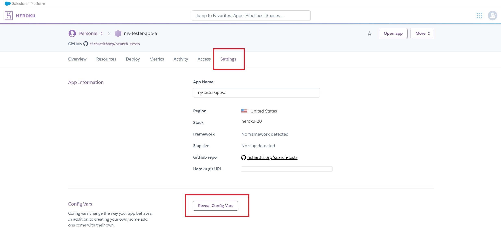

# Rodeo Hot Sauce
This website has been created for a ficticious hot sauce brand, "RODEO HOT SAUCE". 

[Click here to view live website](https://rodeo-hot-sauce.herokuapp.com/)
## Table of Contents
[Website Owners Objectives](#objectives)

[User Experience - UX](#UX)

[Design](#design)

[Features](#features)

[Languages and Technologies](#tech)

[Testing](#testing)

[Deployment](#deployment)

[Credits](#credits)

## Website Owners Objectives
The primary objectives of the website are to enable to brand to:

* Increase brand awareness
* Increase sales
* Promote customer loyalty
* Generate a sense of community amongst consumers
* Collect customer data
* Improve understanding of consumers

## UX
### User Profiles
As a user of this website, I am someone looking to find recipes, or to contribute recipes to a community. I am an English speaker with an interest in cooking with hot sauce.

### User Stories
As a user of the website, I want:
* To be able to navigate through the website in an intuitive and easy fashion
* To discover popular recipes involving hot sauce
* To dicover new recipes involving hot sauce
* To be able to quickly and easily search the recipes to find specific ingredients or meal types
* To contribute my own recipes to the website community
* To be able to quickly edit or delete recipes that I have contibuted
* To be able to save recipes that interest me and be able to access them quickly
* To be able to rate recipes and have those ratings influence the information hierarchy throughout the website
* To be able to log in and log out of the website easily
* For the data presented to me to be specific to me.

## Design

### Wireframes
[Click here to see index.html wireframes](static/images/readme-images/wireframes/index.png)

[Click here to see login.html wireframes](static/images/readme-images/wireframes/login.png)

[Click here to see register.html wireframes](static/images/readme-images/wireframes/register.png)

[Click here to see add-recipes.html wireframes](static/images/readme-images/wireframes/add-recipes.png)

[Click here to see my-recipes.html wireframes](static/images/readme-images/wireframes/my-recipes.png)

[Click here to see all-recipes.html wireframes](static/images/readme-images/wireframes/all-recipes.png)

[Click here to see recipe-page.html wireframes](static/images/readme-images/wireframes/recipe-page.png)

### Mock-ups
[Click here to see index.html mock-ups](static/images/readme-images/mock-ups/index-mock-up.jpg)

[Click here to see login.html mock-ups](static/images/readme-images/mock-ups/login-mock-up.jpg)

[Click here to see register.html mock-ups](static/images/readme-images/mock-ups/register-mock-up.jpg)

[Click here to see add-recipes.html mock-ups](static/images/readme-images/mock-ups/add-recipe-mock-up.jpg)

[Click here to see my-recipes.html mock-ups](static/images/readme-images/mock-ups/my-recipes-mock-up.jpg)

[Click here to see all-recipes.html mock-ups](static/images/readme-images/mock-ups/all-recipes-mock-up.jpg)

[Click here to see recipe-page.html mock-ups](static/images/readme-images/mock-ups/recipe-page-mock-up.jpg)

### Colour Scheme

The colours found throughout the website were selected using the [Coolors](https://coolors.co/) colour scheme generator. I created new with the generator until I found one that featured a selection of bright and lively, but not garish colours.
The 'Pine Green' colour found in the header and footer provides a strong background on which brings clarity to the bold white logo and links. The colour is also used for all button elements found throughout the website which brings consistancy and allows the user to quickly see that the elements are interative.
The bright yellow 'Citrine' colour is used as a background to the main body of the website. This colour contrasts well with the 'Pine Green' header and footer, and provides a bright, fresh and natural feel to the site.
The lighter 'Blond' colour works well against the 'Citrine' to highlight different aspects of the website to the user, such as the recipe cards and containers for the search and filter elements. The lightness of the shade allows for the black font, any clickable 'Pine Green' buttons and recipe images to to stand out from the background.

### Fonts
The font used for the 'Rodeo' logo is 'Young Heart', sourced from [wfonts](https://www.wfonts.com/). The font was chosen because of it's similaries to old western wanted posters which fits the branding of the hot sauce. As well as this, the font is decorative and more interesting than standard block lettering, whilst still being clearly legible. This also meant the font could be used throughout the website for the main navigational links and headings.

The font 'Bevan' is used in all sub-headers and buttons thoughout the website. This font was sourced from [Google Fonts](https://fonts.google.com/). Once again, this font was chosen because of it's similarities to old western wanted posters. The font is clear and striking, making it very effective at breaking up the page with sub-headers.

For the rest of the site, 'Open Sans' was used due to its clean and clear style. The recipe instructions and ingredients and rendered with this font as it is clear and easy to read, even at small font sizes. This font was also sourced from [Google Fonts](https://fonts.google.com/).

### Database Design
#### Database Collections
The  image below lists the collections found in the MongoDB database. Whilst the 'Recipe' and 'Users' collections were created specifically for the Rodeo app, FS Files and FS Chunks were created automatically with the uploading of images to the database.

#### Database Schema
This image shows the database schema for the app. Where a line runs from '1' - '*', this highlights a one to many relationship.

## Features
### Implemented Features

#### Header and Footer
The header and footer elements are consistant throughout the website. To the left of the header is a clickable logo, which links to **index.html**. This is standard practice in web design and expected by the user.

To the right of the header on screen sizes of 768px wide or more, are three navigation links. On smaller screens the links are contained in a dropdown menu which is triggered by a standard menu icon. Again, this is common in web design and the user will naturally understand the purpose of this icon. These links have clear 'hover' effects, that make the font slightly larger and brighter when the cursor is moved over them in order to reinforce to the user that these are clickable links.

The links themselves change depending on whether or not the user is logged in to the website. If the user is not logged in, a link to **'RECIPES'** is presented, where users can browse all the recipes available on the website, as well as **'LOGIN'** and **'REGISTER'**. A logged in user will be presented with the same **'RECIPES'** link, as well as a link to **'MY RECIPES'**, where they have the options to view their favourite recipes, as well as view, add and edit recipes that they have uploaded. Finally, a **'LOG OUT'** link is provided.

At the right of the footer, the same 3 links are presented and are also dependent on the user being logged in or out. On screens smaller than 768px however, a link that reads **'BACK TO TOP'** is offered, which will return the user to the top of the current page.

At the left of the footer is a copyright notice, which uses JavaScript to automatically update the year displayed.

#### index.html
The **index.html** landing page immediately presents to the user a striking and colourful illustration of a bottle of 'Rodeo Hot Sauce' as well as the tagline 'ADD SOME KICK TO YOUR COOK'. This serves as to suggest to the user that this website is exciting and interesting - as well as belonging to the 'Rodeo Hot Sauce' brand.

Just below this is a small 'WELCOME' section, highlighted but a bright red background. This section succinctly explains to the user the purpose of the website and what a user can expect to gain by registering and using the website.

At the bottom of the page is the 'SOME INSPITRATION' section featuring 3 recipe cards presented in a column for screens of up to 768px wide and in a row for screens sized 992px wide and over. In between these sizes, 2 recipe cards are offered in a row in order to maintain the legibility and clarity of the cards, and to keep the page symmetrical.

The recipe cards consist of an image, a recipe title, an average rating displayed by a star ratings out of five, and a 'favourite recipe?' heart icon.

By clicking on the recipe cards image or recipe name, the user is taken to the page containing the actual recipe.

The font size for the recipe name is reduced with a JavaScript function if the title contains 28 or more characters, in order to keep all the content of the recipe cards within a similar size of each other across a row.

If a user attempts to click on the 'favourite recipe?' button without being logged in, a popover is presented which prompts the user to either **'LOG IN'** or **'REGISTER'** with those words acting as links to the relevant pages.

If the user is logged in, when hovering the cursor over the heart icons a tooltip is displayed which will suggest to the user either 'Add to favourites' or 'Remove from favourites' depending on whether or not the user has previously 'favourited' the recipe. If the recipe has been 'favourited', a solid heart icon is rendered, otherwise a heart outline is rendered.

By clicking the 'Favourite Recipe' icon, the user can add or remove recipes from their **'MY RECIPES'** page. A message will slide down underneath the navigation bar and tell the user that the recipe has been successfully added or removed from their favourites.

These cards can be found on **'index.html'**, **'all_recipes.html'**, **'my_recipes.html** and **''added_recipies.html** and are always presented and function in the same way.

Below these recipe cards is a clickable button which says to the user 'CLICK HERE TO SEE MORE RECIPES'. This links to the **'RECIPES'** page which displays all recipes on the website. 

This button also has clear cursor 'hover' effect to highlight that this is a clickable link.

Normal link           |  Cursor hover link
-------------------------:|:-------------------------
  |   

This button styling is found throughout the website for all clickable buttons in order to provide consistancy and allow the user quickly locate these interactive elements.

#### login.html
#### register.html
#### my_recipes.html
#### all_recipes.html
#### recipe_page.html
#### added_recipes.html
#### add_recipe.html
#### edit_recipe.html
#### 404.html

#### Potential Future Features

## Languages and Technologies
### Languages
The front-end of the website is build with HTML, CSS and JavaScript and the back-end in Python.

### Technologies
#### IDE and Version control and Deployment
* [Gitpod](https://www.gitpod.io/)
   * The IDE used to write the code for the website.
   
* [Git](https://git-scm.com)
   * Used for version control during the website build via the command terminal in Gitpod
   
* [GitHub](https://pages.github.com/)
   * Used to store the code after being 'committed' and 'pushed' using Git. The website is now hosted via GitHub pages.

* [Heroku](https://www.heroku.com/)
   * Used to deploy the website

#### Database
* [MongoDB](https://www.mongodb.com/)
   * The database used to store the recipe and user data.

#### Libraries, Frameworks and Packages 
* [Bootsrap](https://getbootstrap.com/)
   * Used to provide structure, responsiveness and some CSS styling  to the front-end. Also used to add modals, tooltips, dropdowns and popovers.

* [Jquery](https://jquery.com/)
   * jQuery is required to power certain Bootstrap features, including elements mentioned above. jQuery is also used to shorten the syntax required to achieve certain functions, such as targeting HTML elements within the JavaScript file.

* [Flask](https://flask.palletsprojects.com/)
   * A micro-web framework. Flask is packaged with Werkzeug and Jinja which work together to simplify accessing data at the back-end and presenting it to the client at the front-end. 

* [Pymongo](https://pymongo.readthedocs.io/)
   * A MongoDB driver. Used to enable the Python code to interact with MongoDB.

* [WTForms](https://wtforms.readthedocs.io/)
   * Used to create the form elements of the website with Python and add form validation to the back end. WTForms also provides protection from CSRF attacks.

#### Design and Fonts
* [Balsamiq](https://balsamiq.com/)
   * Software used to create wireframes of website.

* [Figmna](https://www.figma.com/)
   * Software used to create mock-ups of website.

* [Coolors](https://coolors.co/)
   * Used to generate the colour palette for the website.

* [Google Fonts](https://coolors.co/)
   * Used to provide the 'Open Sans' and 'Bevan' fonts used throughout the website.

* [Font Squirrel](https://www.fontsquirrel.com/)
   * Used to provide the 'Open Sans' and 'Bevan' fonts used throughout the website.

* [RealFaviconGenerator](https://realfavicongenerator.net/)
   * Used to refine the favicon and provide the HTML to link to the file.

* [dbdiagram](https://dbdiagram.io/)
   * Used to make image of database schema.

#### Testing and Optimisation
* [W3C Markup Validation Service](https://validator.w3.org/)
   * Validation of the HTML code.

* [W3C CSS Validation Service (Jigsaw)](https://jigsaw.w3.org/css-validator/)
   * Validation of the CSS code

* [JSHint](https://jshint.com/)
   * Validation of the JavaScript code.

* [Autoprefixer](https://autoprefixer.github.io/)
   * Used to ensure cross browser validity for CSS.

* [TinyPNG](https://tinypng.com/)
   * Used to compress any local images.

* [Am I Responsive?](http://ami.responsivedesign.is/)
   * Used to test for responsive design and to create the mock-ups found at the top of this README.

* [Chrome DevTools](https://developer.chrome.com/docs/devtools/)
   * Used to test responsivity of website and test contrast between backgrounds and fonts. Also used to check for any JavaScript errors or warnings printing the console.
   

## Testing

## Deployment
### Prerequisites

#### Github Repository
Prior to deploying the app to Heroku, the code was stored in a GitHub repository. This made it easy to push any changes from a local git repository to the remote GitHub repository and have Heroku automatically deploy the most recent version of the app from GitHub (see step 7 of 'Deployment to Heroku' below).

#### Application Requirements
In order for Heroku to know how to run the app, a requirements.txt file must be present in the repository's root folder. This file can be created by running the command `pip freeze > requirements.txt` from the command line. This will create a file that lists all the dependencies needed to run the app.

#### Heroku Procfile
Heroku also needs a 'Procfile' to know how to run the app. In this instance, the command `echo web: python app.py > Procfile` will create a file that gives Heroku the instructions that this is a web application and it can be run with the command `python app.py`.

#### MongoDB URI
In order to connect the app to the MongoDB database, the URI for the database can be found using the following steps:

1. Log in to MongoDB

2. Once on the MongoDB Dashboard, click on the 'Connect' button.

3. From the pop-up, select 'Connect your application'.

4. On the following menu, select the appropriate driver and driver version options, and the URI will be presented to you. As per the instructions below the URI, `"Replace <password> with the password for the richardThorp user. Replace myFirstDatabase with the name of the database that connections will use by default."`

5. This URI should be kept in an 'env.py' file in the local repository with any other sensitive data, as it contains the password to the MongoDB database. The 'env.py' file must also be included in the 'gitignore' file to ensure that the data is never sent to the GitHub repository.

## Deployment to Heroku
With the code required to run the app all stored in a repository with Github, deplying the app with Heroku can be done following these steps:

1. Sign in/sign up to [Heroku](https://www.heroku.com/).

2. Once signed in, click on the 'Create New App' button.

3. Name the app, select the local region and click 'Create App'.

4. In the top menu, select the 'Deploy' tab, and then click 'Connect to GitHub' in the 'Deployment method' section.

5. Connect your GitHub account to your Heroku account by clicking on the 'Connect to GitHub' button (if already connected, move to step 6).

6. Search for the GitHub repository which contains the app you wish to deploy, and then click 'connect'.

7. Once connected, you can choose to automatically deploy any updates made in the GitHub repository or to do so manually by selecting the branch you wish to deploy and clicking on the appropriate button.

8. Following this, click on the 'Settings' tab and then click 'Reveal Config Vars'

9. Within the 'Reveal Config Vars' section, add the variables which would be found in your local 'env.py' file. These variables are saved here as they contain sensitive data such as the password to the MongoDB database and the secret key required to use some of Flask's functionality.

10. With all of the previous steps complete, as well as the prerequisites, the app will now run by clicking the 'Open app' button.

## Credits

### Code

### Content

### Acknowledgements
