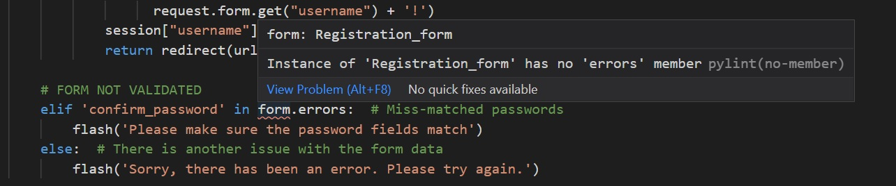

# Testing
## Testing against User Stories
### **To be able to navigate through the website in an intuitive and easy fashion.**

The website conforms to standard website UX principles. All pages have a navigation bar which provides clear links to the main pages of the website. Any links or buttons feature cursor hover effects to make clear that they are interactive elements. Where appropriate, a 'back to...' button is provided to ensure the user can quickly and easily return to search results or lists of recipes. 

### **To discover popular recipes involving hot sauce**

When visiting the website, the first page presented to the user displays a small amount of content before offering 2 or 3 (depending on screen size) of the website highest rated recipes. Below this is a link to browse all of the recipes available on the website which are by default presented with the highest rated recipes first.

### **To discover new recipes involving hot sauce**
Whilst browsing any of the pages that list the recipes, the option to sort the recipes by newest first is available via a clear 'sort by: newest' link above the recipe cards.

### **To be able to quickly and easily search the recipes to find specific ingredients or meal types**
Whilst browsing any of the pages that list the recipes, a search text input and options to filter the recipes are available above the listed recipes. The search feature will search the relevent recipes for that page (ie. on **'/added_recipes'**, only recipes that the user has added) for any matching words in the recipe name and ingredient fields.
As well as this, the user has the option to filter the recipes by type ('vegetarian', 'vegan' or 'meat') and the further filter by options such as 'quick', 'healthy' and 'gluton free'.

### **To contribute my own recipes to the website community**
Once a user is registered and logged in, they are directed to **'/my_recipes'**. Whist this page is mainly dedicated to displaying recipes that the user has added to their favourites, the link to **'/add_recipe'** is clearly displayed towards the top of the page. Once on **'/add_recipe'**, a simple form is available for the user to fill out and submit their recipe to the database. This recipe is then immediately available to view on the website.

### **To be able to quickly edit or delete recipes that I have contributed**
Once a user has added their recipe to the database via **'/add_recipe'**, they are directed to the **'/recipe_page'** page for that recipe. At the top of this page are links to 'edit' and 'delete' the recipe. By clicking on the 'edit' button, the user is returned to the same form that they filled out in **'/add_recipe'**, with all the existing recipe information in the form ready to be edited. By clicking on the 'delete' button, a modal is triggered which asks the user "Are you sure you want to delete this recipe? This cannot be undone!". At this point the user can either immediately delete the recipe from the database, or return to the recipe page.

The 'edit' and 'delete' buttons are also available to the user at the bottom of each recipe card in the **'/added_recipes'** page.

### **To be able to save recipes that interest me and be able to access them quickly**
If the user is logged in, any page that displays a recipe or recipe cards features the 'FAVOURITE RECIPE?' heart icon. Once clicked, the recipe can be accessed quickly through the 'MY RECIPES' link in the navigation bar or footer. If the recipe is already in the users 'MY RECIPES' page, clicking the heart icon will remove the recipe from the list. 

### **To be able to rate recipes and have those ratings influence the information hierarchy throughout the website**
If the user is logged in, whilst on a **'/recipe_page'** page, the option to rate the recipe out of 5 stars is available. Once a user rating is sent, the average rating for that recipe is updated to reflect the new score. This in turn will move the recipe up or down the lists presented in **'/all_recipes'**, **'/my_recipes'** and **'/added_recipes'**.

### **To be able to log in and log out of the website easily**
If the user in not logged in, a link to **'/login'** is available in the navigation bar, and if the user is logged in a link to the **'logout'** function is presented.

### **For the data presented to me to be specific to me.**
By adding favourite recipes to the **'/my_recipes'** list, as well as adding their own recipes, users can curate their own selection of recipes that can be accessed by logging in to the website.

## **Testing against Brand Objectives**
### **Increase brand awareness**
By having a website to direct consumers and potential consumers to, the brand has a platform on which to promote itself. With the website focussing heavily on users adding their own recipes and viewing other peoples recipes, the potential for users themselves to promote the brand by sharing recipes with friends and family and across social media is provided.

### **Increase sales**
At present, there is no requirement to have 'Rodeo Hot Sauce' as an ingredient in the recipes. Whilst this was considered, it was decided that it would not be conducive to encouraging people to use the site by restricting the content in that way. However, by establishing the website as a hub for good quality hot sauce recipes, this would add to the perception of 'Rodeo' being a quality product and brand, and therefore in turn increase sales.  

### **Generate a sense of community amongst consumers**
By providing a platform for fans of hot sauce to come together and share in their love of hot sauce recipes, the website enables and encourages people to contribute to the community. As mentioned in the 'Potential Future Features' section of the README document, to further this goal it would be beneficial to add an 'add comment' feature to the recipe pages to allow users to interact with each other.

### **Collect customer data**
By requiring users to register with their email address, the brand can use these addresses to send marketing direct to their target audience.

### **Improve understanding of consumers**
As mentioned in 'Potential Future Features', a great way to accomplish this objective would be to provide a dashboard for the website owners which displays which types of recipes are being added and which recipes are most popular. Unfortunately, time constraints mean this feature is unfeasable at this time.

### **A note on Testing against Brand Objectives**
I feel that whilst these objectives have been met to some extent, as the focus of this project is firmly on the access to and manipulation of a shared data set for users, these objectives have not been a priority in the design or implementation of the website.

## Validation
### HTML
The HTML code has been validated against the [W3C Markup Validator](https://validator.w3.org/). This was done by copying the HTML code from Chrome Dev Tool once rendered in the browser, for all pages whilst both logged in and logged out of the website, and pasting the code into the validator. This was neccessary in order to test the code in it's final state after being proccessed by the Jinja templates. The HTML code contains no validity issues.

### CSS and Javascript
The CSS code has been validated against the [W3C CSS Validator](https://jigsaw.w3.org/css-validator/) and the JavaScript with the [JS Hint](https://jshint.com/) code analysis tool, with any issues highlighted by the validators fixed. The code contains no validity issues.

### Python
All Python code was written to be PEP 8 compliant. The only error message thrown by the Gitpod linter is 'Instance of 'Registration_form' has no 'errors' member'. I am unsure as to why this error is thrown as the function which uses the Registration_form.errors object has been tested and works as expected. The function has access to the data in the error object and uses the flash function to display a custom error message depending on the content of that object.

## Responsive testing
The website has been developed and tested to ensure a high level of responsiveness. This has been achieved using Google Chrome Dev Tools, testing on different physical devices as listed below and by viewing the site on [Am I Responsive?](http://ami.responsivedesign.is/).
### Responsive testing procedure
Check that text, images and all other elements load with correct styles and spacing all all pages. On mobile and tablet, rotate the screen to landscape orientation and repeat the checks. Whilst testing on laptop, using each browsers developer tools, resize the page and ensure all elements respond to the screen size accordingly.

## Manual testing of all elements throughout the website
The tests detailed in this section were all completed using the following web browsers and hardware:
|                            | Chrome             | Edge             | Firefox            | Safari |
| -------------             |:------------------:| -----------------:|-------------------:|--------:|
| Microsoft Surface 3 (15") | :heavy_check_mark: |:heavy_check_mark: | :heavy_check_mark: |         |
| Samsung Galaxy A6         | :heavy_check_mark: |:heavy_check_mark: | :heavy_check_mark: |         |
| Huawei P Smart 2019       | :heavy_check_mark: | :heavy_check_mark:| :heavy_check_mark: |         |
| Macbook Pro 2016 (13")    | :heavy_check_mark: |                   | :heavy_check_mark: |:heavy_check_mark: |
| iPad 7th generation 2019  | :heavy_check_mark: |                  | :heavy_check_mark: |:heavy_check_mark: |

**********************

### Testing of site-wide features
#### **Header and footer**
##### **Logged out user**
1. Ensure navigation bar links read 'RECIPES', 'LOGIN' and 'REGISTER'.
2. In the footer, check that same links are visible on screens above 768px wide as well as the copyright information. 
3. On a screen smaller than 768px wide, ensure that the copyright information is visible, and in place of the 3 navigation links there is one link to go 'BACK TO TOP'.
4. Mouse over 'RODEO' logo
    * Ensure cursor becomes a pointer.
5. Click on 'RODEO' logo
    * Ensure logo links to /index.
6. Mouse over footer links
    * Ensure cursor becomes a pointer and hover effect is triggered.
7. Click on footer links
    * Ensure links direct to correct page.

##### **Logged in user**
1. Ensure navigation bar links read 'RECIPES', 'MY RECIPES' and 'LOG OUT'. 
2. Repeat steps 2 to 7 from **Logged out user** above

*******************************************

#### **Recipe Cards**
##### **Logged out user**
1. Mouse over all elements on the cards
    * Ensure cursor becomes a pointer over image, recipe name and 'FAVOURITE RECIPE' heart icon.
2. Click on recipe image
    * Ensure image links to corresponding recipe page.
3. Click on recipe name
    * Ensure name links to corresponding recipe page.
4. Click on the heart icon
    * Ensure popover is triggered and that links to /login and /register work as expected.
    * Ensure popover is dismissed on next click.

##### **Logged in user**
1. Repeat step 1 to 3 from **Logged out user** above
2. Mouse over the heart icon
    * Ensure that a tooltip is rendered. If the recipe has not been previously favourited, ensure tooltip reads 'Add to favourites' and the heart outline is rendered. If the recipe has been previoulsy favourited, ensure tooltip reads 'Remove from favourites' and the solid heart is rendered.
3. Click on heart icon
    * Ensure that a message slides down from the navigation bar to say whether the recipe was added or removed from favourites. Ensure message slides back up after 4 seconds.
    * Ensure that the heart icon is toggled - solid icon if recipe is in favourites and outline of icon if not in favourites.
    * Navigate to 'MY RECIPES' and ensure that the relevent recipes are either added or removed from the list.
    * Ensure that the 'FAVOURITE RECIPE?' toggle returns to the same page that it was used on. 
        * After using a combination of search, filter, sort by and pagination features, use the 'FAVOURITE RECIPE?' toggle. Ensure that the return page is the same as the page on which the function was called. 

**********************************
#### **Search and filter functionality**
1. Mouse over 'SEARCH' button
    * Ensure cursor becomes a pointer and hover effect is triggered.
2. Type text into the text input and click on 'SEARCH'
    * Ensure relevant search results are returned.
    * If no results are returned, ensure text reads 'NO RECIPES FOUND! Please adjust your search term or filters and try again.'
    * If more than 9 results are returned, ensure pagination links are rendered at the bottom of the page (see pagination link testing below).
    * Ensure 'REMOVE SEARCH TERMS AND FILTERS' button is rendered
        * Mouse over button and ensure hover effect is triggered.
        * Click on the button and ensure button links back to original page, and that all relevant recipes are displayed.
3. Mouse over 'FILTER' button
    * Ensure cursor becomes a pointer and hover effect is triggered.
4. Select different options, including a combination of recipe type (vegetarian, vegan, meat) and recipe options and click on 'FILTER' button.
    * Ensure relevant recipes are returned.
    * If no results are returned, ensure text reads 'NO RECIPES FOUND! Please adjust your search term or filters and try again.'
    * If more than 9 results are returned, ensure pagination links are rendered at the bottom of the page (see pagination link testing below).
    * Ensure 'REMOVE SEARCH TERMS AND FILTERS' button is rendered
        * Mouse over button and ensure hover effect is triggered.
        * Click on the button and ensure button links back to original page, and that all relevant recipes are displayed.

**************************
#### **Pagination links**

1. On first page of available recipes
    * Ensure that the 'PREVIOUS PAGE' link has greyed out effect and that moving the mouse over the link renders no change in the cursor.
    * Mouse over 'NEXT PAGE' link
        * Ensure hover effect is rendered.
    * Click on 'NEXT PAGE' link
        * Ensure that a new page of unique recipes are rendered. If paginating through search and filter results and/or have sorted the recipes by rating or newest, ensure that those conditions are still met.
2. In the middle of available recipes (more than 18 recipes available)
    * Ensure that both 'PREVIOUS PAGE' and 'NEXT PAGE' links are rendered.
    * Mouse over 'PREVIOUS PAGE' and 'NEXT PAGE' links
        * Ensure hover effect is rendered.
    * Click on 'PREVIOUS PAGE' and 'NEXT PAGE' links
        * Ensure that the previous or a new page of unique recipes are rendered. If paginating through search and filter results and/or have sorted the recipes by rating or newest, ensure that those conditions are still met.
3. On the last page of available results
    * Ensure that the 'NEXT PAGE' link has greyed out effect and that moving the mouse over the link renders no change in the cursor.
    * Mouse over 'PREVIOUS PAGE' link
        * Ensure hover effect is rendered.
    * Click on 'PREVIOUS PAGE' link
        * Ensure that the previous page of unique recipes are rendered. If paginating through search and filter results and/or have sorted the recipes by rating or newest, ensure that those conditions are still met.

### Testing of individual pages
#### /index**
1. Test the recipe cards according to the tests written in ['Recipe Cards' above](#recipe-cards)
2. Add and remove ratings to recipes
    * Ensure that the recipe cards in the 'SOME INSPIRATION section are updated to show the 3 highest rated recipes.
3. Mouse over 'CLICK HERE TO SEE MORE RECIPES' link
    * Ensure cursor becomes a pointer and hover effect is triggered.
4. Click on 'CLICK HERE TO SEE MORE RECIPES' link
    * Ensure link directs to /all_recipes.

**************************
#### **/all_recipes**
1. Test navigation bar, footer, search and filter, sort by, recipe cards and pagination links according to tests detailed in ["Testing of site-wide features"](#site-wide-features).

2. Ensure all available recipes are displayed by comparing the number of recipes presented with the number of recipes in the recipe collection of the database.

**************************
#### **/login**
##### **Logged out user**
1. Test navigation bar and footer according to tests detailed in ["Testing of site-wide features"](#site-wide-features).
2. Mouse over 'LOG IN' button
    * Ensure cursor becomes a pointer and hover effect is triggered.
3. Mouse over 'Click here to register' beneath the 'Need to sign up?' text.
    * Ensure cursor becomes a pointer and hover effect is triggered.
4. Click on the 'Click here to register' link
    * Ensure the link directs to /register
5. Enter a valid username and corresponding password
    * Click on 'LOG IN' button
        * Ensure that the button links to /my_recipes
        * Check that the "Welcome, 'username'" message slides in from the navigation bar and that the correct username is presented, and then slides back up after 4 seconds.
6. Enter a valid username with a non valid password
    * Click on 'LOG IN' button
        * Ensure that the button does not link to /my_recipes
        * Check that the "Login details incorrect, please try again" message slides in from the navigation bar, and then slides back up after 4 seconds.
7. Enter an invalid username and a password
    * Click on 'LOG IN' button
        * Ensure that the button does not link to /my_recipes
        * Check that the "Login details incorrect, please try again" message slides in from the navigation bar, and then slides back up after 4 seconds.
8. Enter a username, but no password
    * Ensure 'Please fill in this field' tooltip in presented on the password input.
9. Enter a password, but no username
    * Ensure 'Please fill in this field' tooltip in presented on the username input.

###### **Logged in user**
1. Type 'http://rodeo-hot-sauce.herokuapp.com/login' into the browser address input and hit return
    * Ensure that the address redirects to /my_recipes

**************************
#### **/register**
##### **Logged out user**
1. Test navigation bar and footer according to tests detailed in ["Testing of site-wide features"](#site-wide-features).
2. Mouse over 'REGISTER' button
    * Ensure cursor becomes a pointer and hover effect is triggered.
3. Mouse over 'Click here to log in' beneath the 'Already have an account?' text.
    * Ensure cursor becomes a pointer and hover effect is triggered.
4. Click on the 'Click here to log in' link
    * Ensure the link directs to /login
5. Enter details into all the inputs conforming to the requirements stated
    * Click on 'REGISTER' button
        * Ensure that the button links to /my_recipes
        * Check that the "Welcome to Rodeo, 'username'" message slides in from the navigation bar and that the correct username is presented, and then slides back up after 4 seconds.
        * Within the MongoDB website and in the 'rodeo' database, check that a new document has been added to the 'users' collection, with the username and email in lowercase, and a hashed version of the users password.
6. For each of the inputs, click on the 'REGISTER' button whilst keeping the input empty
    * Ensure 'Please fill in this field' tooltip is presented on the empty input.
7. Enter an invalid email address
    * Ensure 'Please inlcude an @ in the email address' tooltip in presented on the email input.
8. For each of the username and password inputs, enter text that does not conform to the length requirements
    * Ensure 'Please lengthen/shorten this text...' tooltip in presented on the offending input.
9. Enter valid text into all inputs with an email address that already exists in the database
    * Ensure the 'Sorry, that email address already has an account' message slides in from the navigation bar, and then slides back up after 4 seconds.
10. Enter valid text into all inputs with a username that already exists in the database
    * Ensure the 'Sorry, that username is already taken' message slides in from the navigation bar, and then slides back up after 4 seconds.
11. Repeat step 9 but change the casing of the text in the username input
    * Ensure the 'Sorry, that username is already taken' message slides in from the navigation bar, and then slides back up after 4 seconds.
12. Enter valid text into all inputs but type different text into the password and confirm password inputs
    * Ensure the 'Please make sure the password fields match' message slides in from the navigation bar, and then slides back up after 4 seconds.

For all tests above that result in a validation error, ensure that no data is sent to the database by monitoring the 'users' collection in the database.

###### **Logged in user**
1. Type 'http://rodeo-hot-sauce.herokuapp.com/register' into the browser address input and hit return
    * Ensure that the address redirects to /my_recipes

**************************

#### **/recipe_page**
##### **Logged in user**
1. Test navigation bar and footer according to tests detailed in ["Testing of site-wide features"](#site-wide-features).
2. Add a new recipe to the database (via /add_recipe) and make sure to upload an image for the recipe
    * Ensure all the details of the newly added recipe are rendered correctly on the /recipe_page page.
    * Ensure that the correct recipe image has been rendered.
    * Check that the 'EDIT' and 'DELETE' buttons have been rendered at the top of the page
        * Mouse over the buttons and ensure cursor becomes a pointer and hover effect is triggered.
        * Click on the 'EDIT' button and make sure it links to /edit_recipe and that the correct information is automatically entered into the form inputs
        * Click on the 'DELETE' button
            * Ensure that the delete recipe modal has been triggered
                * Mouse over the 'CLOSE' and 'DELETE RECIPE' buttons and ensure cursor becomes a pointer and hover effect is triggered.
                * Click the 'CLOSE' button and ensure the modal is removed
                * Click anywhere outside of the modal and ensure the modal is removed
3. Within the MongoDB website and in the recipe document, make a note of the name given to the image. Find the corresponding document in the FS.files collection using the image name and make a note of the ObjectID of this file.
4. Via the delete recipe modal, click on 'DELETE RECIPE'
    *  Within the MongoDB website, make sure that the recipe has been removed from the recipes collection.
    * Check within the MongoDB website that the file data has been removed from the FS.files collection using either the image file name or the ObjectID noted in step 2.
    * Within the MongoDB website, navigate to FS.chunks. Ensure that no document exists in the collection which has a files_id that matches the ObjectID from above.
    * Make sure the the delete button redirects to /added_recipes.
5. Add a new recipe to the database (via /add_recipe) and do not add an image
    * Ensure all the details of the newly added recipe are rendered correctly on the /recipe_page page.
    * Ensure that the default recipe image has been rendered.
6. Navigate to a recipe page from /all_recipes
    * Make sure the 'BACK TO...' link at the top of the page states 'BACK TO ALL RECIPES'
7. Navigate to a recipe page from /my_recipes
    * Make sure the 'BACK TO...' link at the top of the page states 'BACK TO MY RECIPES'
8. Navigate to a recipe page from /added_recipes
    * Make sure the 'BACK TO...' link at the top of the page states 'BACK TO ADDED RECIPES'
6. Navigate to a recipe page from from outside the website
    * Make sure the that the 'BACK TO...' link is not rendered
7. Test the 'ADD TO FAVOURITES' heart icon according to the tests written under "'FAVOURITE RECIPE' heart icon" in the ['Recipe Cards' testing section.](#recipe-cards)

On a screen wider than 768px:

1. Mouse over 'ADD RATING' button
    * Ensure cursor becomes a pointer and hover effect is triggered.
2. Mouse over the user rating stars
    * Ensure cursor becomes a pointer and the all stars to the left of the current star are changed to dark gold.
3. Click on a user rating star
    * Check that the star and all other stars to the left are changed in colour to gold, and that the colour remains when the mouse is moved away.
    * Click on a different star and ensure the outcome is the same as above.
4. Click on a user rating star and then click 'ADD RATING' button
    * Check that the 'Thank you for your rating' message slides in from the navigation bar, and then slides back up after 4 seconds.
    * Check that the new rating is reflected in the 'Average Rating' stars on the page.
    * Within the MongoDB website and in the 'rodeo' database, find the corrosponding recipe document in the 'recipes' collection. Make sure that the ratings object in the document is updated accordingly.
5. Commit a 'hard refresh' of the recipe page (to clear out any cached version stored in the browser)
    * Make sure that the user rating stars are coloured gold to correlate rating given in step 5.
6. Repeat steps 5 and 6
    * Make sure that the ratings object for the recipe only contains one key-value pair for the username, and that the value has been updated.
7. Click on 'ADD RATING' button without first clicking on a star
    * Ensure a tooltip is rendered which states 'Please click on a star to submit a rating'
    * Within the MongoDB website, find the corresponding recipe in the recipes collection and make sure no data has been added to the ratings object.

On a screen less than 768px wide:

1. Mouse over 'VIEW RATINGS' button
    * Ensure cursor becomes a pointer and hover effect is triggered.
2. Click on 'VIEW RATINGS' button
    * Ensure that the ratings modal is triggered
3. Within the ratings modal, repeat steps 3 to 6 above.

##### **Logged out user**
1. Test navigation bar and footer according to tests detailed in ["Testing of site-wide features"](#site-wide-features).
2. Test the 'ADD TO FAVOURITES' heart icon according to the tests written under ["'FAVOURITE RECIPE' heart icon"](#favourite-recipe-toggle) in the 'Recipe Cards' testing section.
3. Navigate to a recipe page from /all_recipes
    * Make sure the 'BACK TO...' link at the top of the page states 'BACK TO ALL RECIPES'
4. Navigate to a recipe page from from outside the website
    * Make sure the that the 'BACK TO...' link is not rendered
5. Click on the 'ADD RATING' button
    * Ensure that the 'LOG IN or REGISTER to rate recipes' popover is rendered and that the 'LOG IN' and 'REGISTER' link to the relevant pages.

**************************
#### **/my_recipes**
##### **Logged in user**
1. Test navigation bar and footer according to tests detailed in ["Testing of site-wide features"](#site-wide-features).
2. Ensure the 'VIEW MY FAVOURITE RECIPES' button has the 'current-button' CSS class applied (background-color:#136F63, color: #FFF)
3. Ensure the other 2 buttons ('VIEW MY ADDED RECIPES', 'ADD A NEW RECIPE') have the standard 'my-recipe-buttons' CSS class
4. Mouse over 'VIEW MY ADDED RECIPES' and 'ADD A NEW RECIPE' buttons
    * Ensure cursor becomes a pointer and hover effect is triggered.
5. Test the search and filter functionalilty according to tests detailed in ["Testing of site-wide features"](#site-wide-features).
6. Test the 'Sort recipes by:' links according to tests detailed in ["Testing of site-wide features"](#site-wide-features).
7. On /all_recipes, add a selection of recipes to /my_recipes using the 'FAVOURITE RECIPE' heart icon (at least 19 recipes needed)
    * Navigate to /my_recipes and ensure that the correct recipes are present
    * Test the pagination links according to tests detailed in ["Testing of site-wide features"](#site-wide-features).
    * Using the 'FAVOURITE RECIPE' heart icon on the recipe cards, remove a selection of recipes from the list
##### **Logged out user**
1. Type 'http://rodeo-hot-sauce.herokuapp.com/my_recipes' into the browser address input and hit return
    * Ensure that the address redirects to /login

**************************
#### **/added_recipes**
##### **Logged in user**
1. Test navigation bar and footer according to tests detailed in ["Testing of site-wide features"](#site-wide-features).
2. Ensure the 'VIEW MY ADDED RECIPES' button has the 'current-button' CSS class applied (background-color:#136F63, color: #FFF)
3. Ensure the other 2 buttons ('VIEW MY FAVOURITE RECIPES', 'ADD A NEW RECIPE') have the standard 'my-recipe-buttons' CSS class
4. Mouse over 'VIEW MY FAVOURITE RECIPES' and 'ADD A NEW RECIPE' buttons
    * Ensure cursor becomes a pointer and hover effect is triggered.
5. Add a selection of recipes using /add_recipe (at least 19 recipes)
    * Ensure only those recipes are presented in /added_recipes
    * Test the pagination links according to tests detailed in ["Testing of site-wide features"](#site-wide-features).
    * Test the search and filter functionalilty according to tests detailed in ["Testing of site-wide features"](#site-wide-features).
    * Test the 'Sort recipes by:' links according to tests detailed in ["Testing of site-wide features"](#site-wide-features).
    * Test the 'EDIT' and 'DELETE' buttons according to tests in [/recipe_page tests](#/recipe_page)
##### **Logged out user**
1. Type 'http://rodeo-hot-sauce.herokuapp.com/added_recipes' into the browser address input and hit return
    * Ensure that the address redirects to /login

**************************
#### **/add_recipe**
##### **Logged in user**
1. Test navigation bar and footer according to tests detailed in ["Testing of site-wide features"](#site-wide-features).
2. Ensure the 'ADD A NEW RECIPE' button has the 'current-button' CSS class applied (background-color:#136F63, color: #FFF)
3. Ensure the other 2 buttons ('VIEW MY FAVOURITE RECIPES', 'VIEW MY ADDED RECIPES') have the standard 'my-recipe-buttons' CSS class
4. Mouse over 'VIEW MY FAVOURITE RECIPES' and 'VIEW MY ADDED RECIPES' buttons
    * Ensure cursor becomes a pointer and hover effect is triggered.
5. Mouse over 'SELECT FILE' and 'ADD RECIPE' buttons
    * Ensure cursor becomes a pointer and hover effect is triggered.
6. Fill out the form with valid data in each input and click 'SUBMIT RECIPE' button
    * Make sure to be directed to the new recipe page
    * Make sure all data is present and correctly displayed on the recipe page
    * On the MongoDB website, find the newly added recipe in the recipes collection
        * Ensure all data is in correct format and in correct data types as stated in the [Database Design section of the README](README.md#database-design)
7. For each of the required inputs (all except for recipe filter checkboxes and image file upload), fill out the form but leave that input blank
    * Ensure 'Please fill in this field' tooltip is presented on the empty input.
8. For each of the inputs that has character length requirements, try to submit the form with invalid lengths
    * Ensure 'Please lengthen/shorten this text...' tooltip in presented on the offending input.
9. With all available text boxes in the 'Ingredients' section containing text, click on the plus button
    * Ensure a new text input is rendered
        * Submit the form with data in the new input and ensure data is processed correctly (ie. the resulting recipe page contains all the data)
10. Repeat step 9 but add multiple new text inputs
11. With any of the ingredient text inputs empty, try to add a new input using the plus button
    * Ensure that the 'Please use this input first' tooltip is rendered
12. Repeat step 11 but keeping different ingredient inputs blank
13. Add text to all available ingredient inputs and add several new inputs all with text data
    * Delete some of the text in the inputs and submit the form
        * Ensure that the resulting recipe page is free of empty ingredient list items
14. Repeat step 13 but using the 'Instructions' text inputs.
15. Add lots of text to an instruction input and ensure that the text box grows in size to accomodate the text.
16. Add a negative number to the 'How many people does it feed?' number input and submit the form
    * Ensure 'Value must be equal to or greater than 1' tooltip is rendered.
17. Select an image under 1MB in size in the file input
    * Ensure that the image name is rendered next to the 'SELECT FILE' button.
    * Submit the recipe and ensure the correct image is displayed in the recipe page.
18. Select an image over 1MB in size in the file input
    * Ensure that an alert is triggered that reads 'File size too big, please choose a smaller file.'
    * Submit the form
        * Ensure no image was sent with the form by checking that the resulting recipe page displays the default image.
19. Select a file which is not an image in the file input and submit the form
    * Ensure that the form data is not sent to the database and that a message that states 'Sorry, there was an issue with the form data. Please try again'.

##### **Logged out user**
1. Type 'http://rodeo-hot-sauce.herokuapp.com/add_recipe' into the browser address input and hit return
    * Ensure that the address redirects to /login

**************************
#### **/edit_recipe**
##### **Logged in user**
1. Navigate to /edit_recipe via the 'EDIT' button on a recipe page that uses the default recipe image
    * Ensure that the edit recipe form inputs are pre-populated with the existing recipe data.
    * Repeat steps 5-16 from the add_recipe test above.
    * Test navigation bar and footer according to tests detailed in ["Testing of site-wide features"](#site-wide-features).
2. Navigate to /edit_recipe via the 'EDIT' button on a recipe card on the /added_recipes page
    * Ensure that the edit recipe form inputs are pre-populated with the existing recipe data
3. Navigate to /edit_recipe using a recipe that does contain a user uploaded image
    * Ensure that the 3 boxes for 'KEEP EXISTING IMAGE', 'USE DEFAULT IMAGE' and 'ADD A NEW IMAGE' are rendered
        * Ensure that the 'KEEP EXISTING IMAGE' is selected by default and that the image is rendered within the box
        * Mouse over the other 2 boxes and ensure cursor becomes a pointer and hover effect is triggered.
    * Submit the form with 'KEEP EXISTING IMAGE' selected
        * Check that the image is still displayed in the resulting recipe page
    * Submit the form with 'USE DEFAULT IMAGE' selected
        * Ensure the existing image is deleted from the database using the tests in steps 3 and 4 of /recipe_page tests
        * Check the default image is displayed in the resulting recipe form
    * Submit the form with a new image selected in the 'ADD A NEW IMAGE' input
        * Ensure the existing image is deleted from the database using the tests in steps 3 and 4 of /recipe_page tests
        * Check the new image is displayed in the resulting recipe form
    * Click on 'ADD A NEW IMAGE' but don't select an image in the file explorer
        * Make sure that the 'ADD A NEW IMAGE' input is not selected
    * Click on 'ADD A NEW IMAGE', select an image in the file explorer but then select a different option from 'USE DEFAULT IMAGE' or 'KEEP EXISTING IMAGE' and submit the form
        * Make sure that the selected option is presented in the resulting recipe page

**************************
#### **/page_not_found (404 error)**
1. Type 'http://rodeo-hot-sauce.herokuapp.com/' into the browser address input followed by a random string and hit return
    * Ensure that the 404.html template is rendered
        * Click on 'WHY NOT COME LOOK AT SOME DELICIOUS RECIPES?' link and ensure it links to /all_recipes

**************************
#### **/server_error (500 error)**
1. In app.py, find the route function for /all_recipes and comment out the line 'form = 'Search_and_filter_form()'
    * Navigate to all recipes
        * Ensure that the 404.html template is rendered
        * Click on 'WHY NOT COME LOOK AT SOME DELICIOUS RECIPES?' link and ensure it links to /all_recipes

**************************
#### **/request_entity_too_big (413 error)**
It has not been possible to test this route function due to issues with running the app on the Flask Development server. When testing this function, the connection to the server cuts out and the 413 error is not returned. This issue has been noted on [Stack Overflow with users saying]("https://stackoverflow.com/questions/19911106/flask-file-upload-limit") that when the app is moved to a production server, the issue is resolved.

